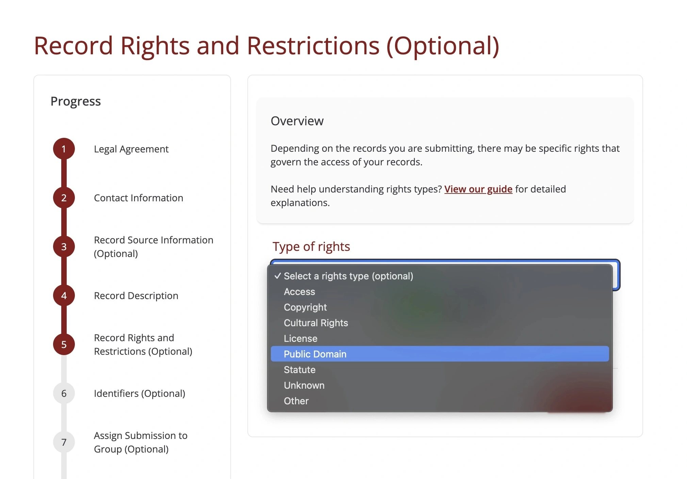
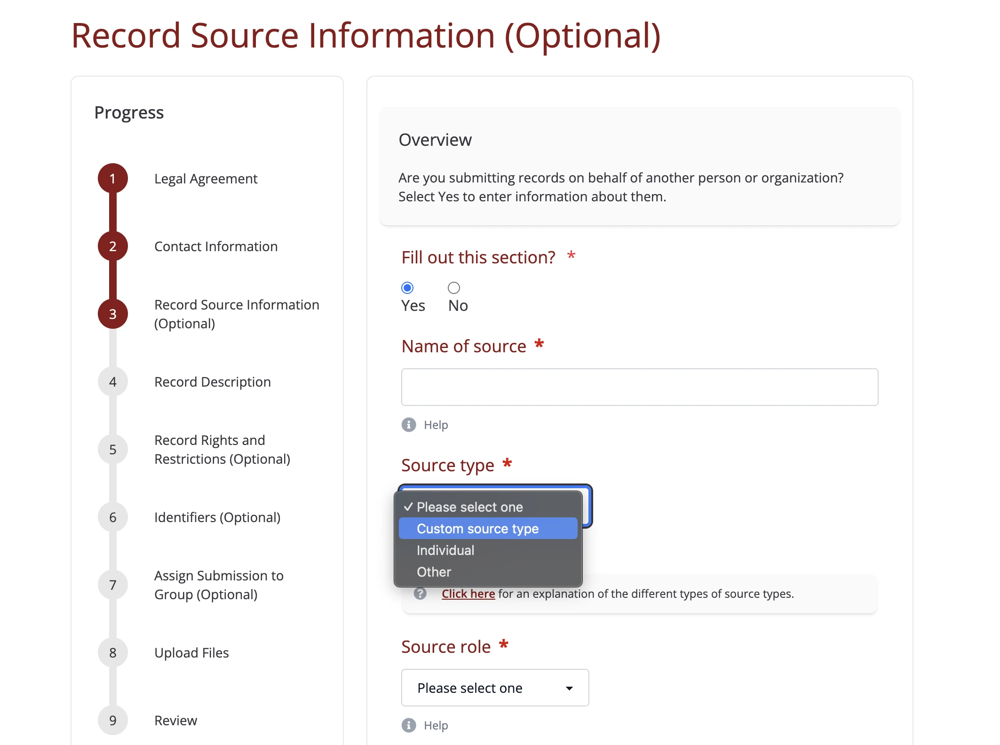
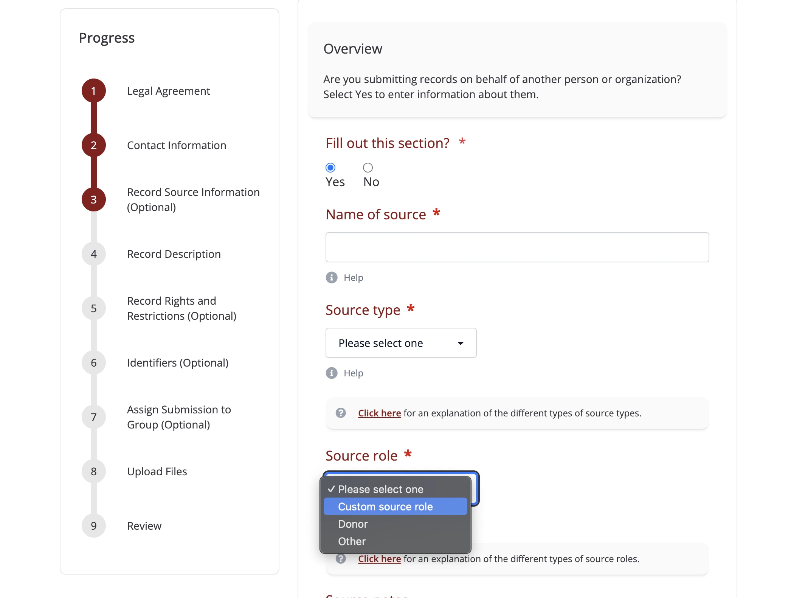

Adding Terms
============

To be inclusive of different types of transfers, the record transfer application allows for the
creation of various taxonomies. These include Rights Types, Source Roles, and Source Types that
users can select from when entering information for their submission. Some default terms are
included in the application, but you can remove them or add new terms to better fit the needs of
your organization.

To add new taxonomy terms, log in to a staff or super user account and go to the administrator
application (accessible at /admin/).

Adding Rights Types
-------------------

To add new Rights Types, click on **Rights Types** in the admin interface.

Next, click **Add Type of Rights**.

The name you enter into the **Name:** box will be added to the list of selections in the dropdown
when a user adds rights in Step 5: Record Rights and Restrictions of the Submission Form.

Click Save when you are satisfied with the new right type.

Now when a user makes it to the right form, the new right type (in this case, "Public Domain") will
show up in the dropdown.

The right type's name and description will also show up in the rights explanation section on the
Help page.

Adding Source Types
-------------------

New source types can be added in a similar way to rights types. To add new Source Types, click on
**Source Types** in the admin interface.

Next, click **Add Source Type**.

Enter an appropriate description and click Save when complete.

The name you enter will now appear in the dropdown when users are defining sources in Step 3:
Record Source Information of the Submission Form.

The source type's name and description will also show up in the source type explanation section on
the Help page.

Adding Source Roles
-------------------

New source roles can be added in a similar way to rights types. To add new Source Roles, click on
**Source Roles** in the admin interface.

Next, click **Add Source Role**.

Enter an appropriate description and click Save when complete.

The name you enter will now appear in the dropdown when users are defining sources in Step 3:
Record Source Information of the Submission Form.

The source role's name and description will also show up in the source role explanation section on
the Help page.

