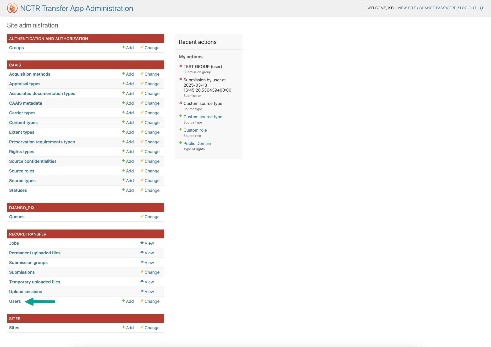
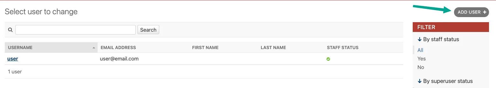
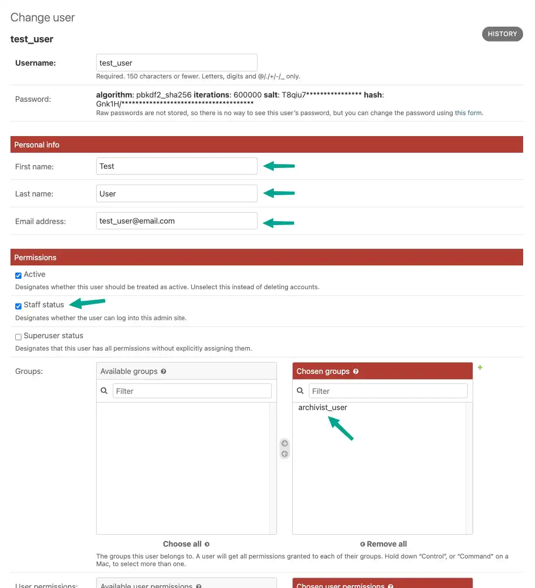
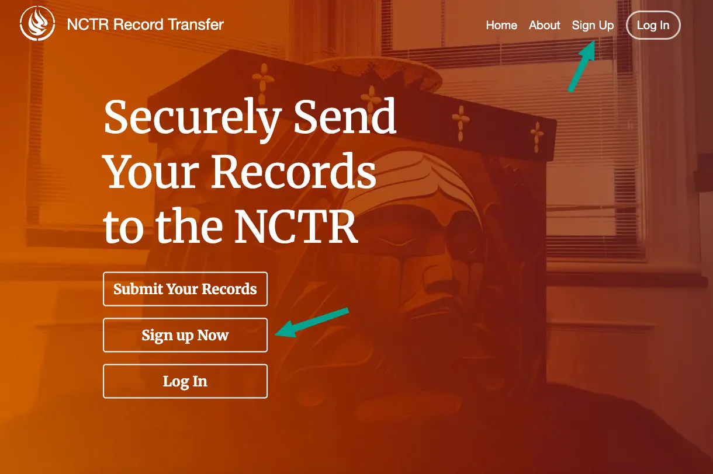
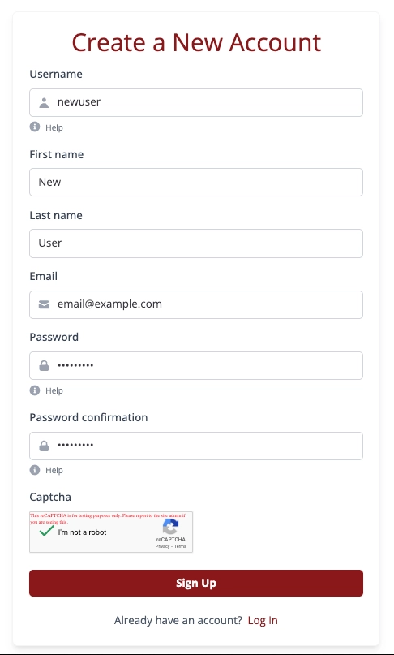
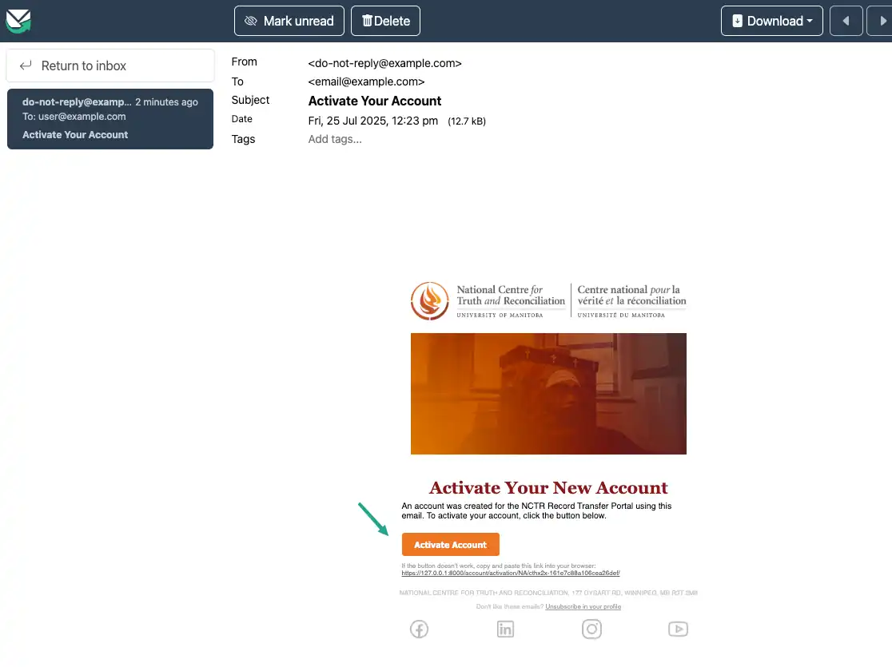
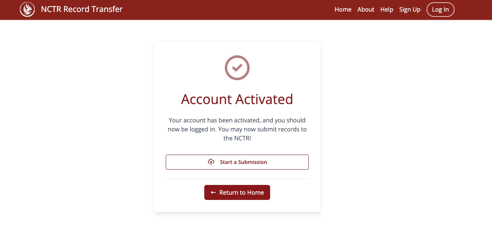

Adding Users
============

Before people start to use the website, they need user accounts. There are three ways to create user
accounts:

* Creating superusers
* Creating users from the backend
* Using the sign-up form

Creating a Superuser
####################

A superuser is a person who has all possible access to view, delete, and change records. You should
assign superuser status sparingly, as these accounts are very powerful.

To create a superuser, use the Django manage script to create a superuser. This script is available
in the container running the Django application.

.. code-block:: bash

    # If running the development version of the app:
    podman-compose -f compose.dev.yml exec app python manage.py createsuperuser

    # If running the production version of the app:
    podman-compose -f compose.prod.yml exec app python manage.py createsuperuser

Creating Users from Admin Site
##############################

A staff member or superuser with access to the administrator application (accessible at /admin/) has
the ability to create new users. To start the process, go to the admin site, and click Users.

Next, click **Add User**.

You will be asked to create a username and password for the user. Fill these out and click **Save
and continue editing**.

Next, fill out their name and email address. If you want to make the user a staff member, check the
Staff box, and assign them to the **archivist_user** group. If you do not assign them to the
**archivist_user** group, they will be able to see the admin app but it will be empty since they
won't have any permissions.

Finally, click **SAVE** at the bottom of the page.

Creating Users with the Sign-up Form
####################################

The simplest way for a new user to be created is to use the sign up form. The Sign Up form can be
accessed by clicking on "Sign Up" link in the header, or the "Sign Up Now" button on the Home
page. Both of these links are only available when the user is not logged in.

.. note::
   You can disable the sign up function by setting :ref:`SIGN_UP_ENABLED` to False in
   recordtransfer/settings.py

After clicking Sign Up, an email will be sent to the email the user entered. They can click the
link in the email to activate their account.

When the user clicks the link or copies and pastes the link into their browser, their account will
now be activated, and they will be able to log in.

