Managing Admin Interface Themes
=================================

The Secure Record Transfer application provides customizable themes for the admin interface. This allows administrators to customize the appearance of the admin interface to match organizational branding or improve usability.

.. contents:: Table of Contents
   :local:
   :depth: 2

.. note::
    Only superusers can access and manage admin interface themes. Regular admin users will not see the Theme Admin.

Changing the Theme
------------------

To change the currently active theme:

1. Log into the admin interface as a superuser
2. Navigate to **Admin Interface** → **Themes**

    .. image:: images/admin_themes_navigation.webp
       :alt: Admin themes navigation

3. You will see a list of available themes

   .. image:: images/admin_themes_select_and_save.webp
      :alt: List of available admin themes

4. Check the **Active** checkbox on your desired theme and click on "Save" to enable it

.. warning::
   Changing the active theme will affect the admin interface appearance for all admin users site-wide. The change takes effect immediately after saving.

.. note::
   Only one theme can be active at a time. Activating a new theme will automatically deactivate the previously active theme.

Adding a New Theme
------------------

To create a new custom theme:

1. Navigate to **Admin Interface** → **Themes** in the admin
2. Click the **Add Theme** button

   .. image:: images/add_new_theme_button.webp
      :alt: Add new theme button

3. Make your desired changes to any of the theme settings (see :ref:`theme-settings` below)
4. Click **Save** to create the theme

Modifying an Existing Theme
---------------------------

To modify an existing theme:

1. Navigate to **Admin Interface** → **Themes** in the admin
2. Click on the theme you want to modify from the list
3. Make your desired changes to any of the theme settings (see :ref:`theme-settings` above for detailed descriptions)
4. Click **Save** to apply your modifications

.. warning::
    Modifying a theme that is currently active will immediately affect the admin interface appearance for all admin users site-wide. Changes take effect as soon as the theme is saved.

.. _theme-settings:

Theme Settings
--------------

The admin interface theme form is organized into several sections, each controlling different aspects of the admin interface appearance and behavior.

.. note::
    The "Environment" and "Inlines" setting sections are left undocumented as their purpose and functionality are unclear.

Basic Settings
~~~~~~~~~~~~~~

**Name**
   A descriptive name for the theme (e.g., "NCTR", "Dark Theme", "Custom Brand")

**Active**
   Checkbox to activate this theme. Only one theme can be active at a time.

Language Chooser
~~~~~~~~~~~~~~~~

.. note::
    Only languages which are set in the application settings will be available. This setting is not configurable.

**Active**
    Checkbox to enable/disable the language selection dropdown in the navigation bar.

**Control**
    Dropdown selection for the type of language selector:
    - ``Default Select`` - Standard dropdown

      .. image:: images/admin_theme_language_chooser_default_select.webp
             :alt: Admin theme language chooser default select type

    - ``Minimal Select`` - More discreet dropdown

      .. image:: images/admin_theme_language_chooser_minimal_select.webp
             :alt: Admin theme language chooser minimal select type

**Display**
   How language options are displayed:

   - ``code`` - Show language codes (e.g., "en", "fr")
   - ``name`` - Show language names (e.g., "English", "French")

Logo (not supported)
~~~~~~~~~~~~~~~~~~~~

.. note::
    Custom logos are not currently supported. The NCTR logo is used by default in the application.

**Logo**
    Upload field for a logo image file

**Max Width**
   Maximum width in pixels for the logo (e.g., 400)

**Max Height**
   Maximum height in pixels for the logo (e.g., 40)

**Color**
    Hex color code for the logo tint/overlay

**Visible**
   Checkbox to show/hide the logo

Favicon (not supported)
~~~~~~~~~~~~~~~~~~~~~~~

.. note::
    Custom favicons are not currently supported. The NCTR favicon is used by default in the application.

**Favicon**
   Upload field for a custom favicon (.ico file)

Title
~~~~~

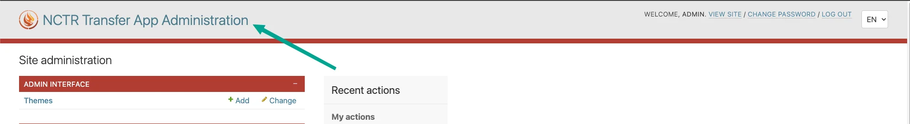

**Title**
    The text displayed in the admin interface header

**Color**
    Hex color code for the title text

**Visible**
    Checkbox to show/hide the title in the header

Header
~~~~~~

Controls the appearance of the admin interface header/ navigation bar.

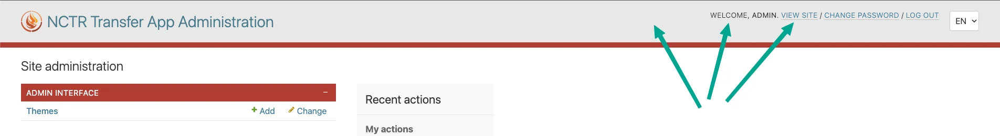

**Background Color**
    Hex color code for the header background

**Text Color**
    Hex color code for header text

**Link Color**
    Hex color code for links in the header

**Link Hover Color**
    Hex color code for header links on hover

Breadcrumbs/Module Styling
~~~~~~~~~~~~~~~~~~~~~~~~~~

Controls the appearance of the breadcrumbs, app modules and fieldset headings.

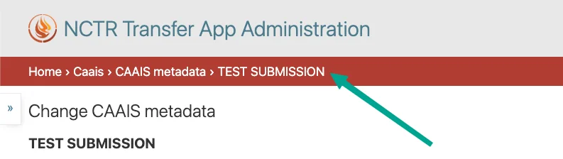

    Breadcrumbs example

|

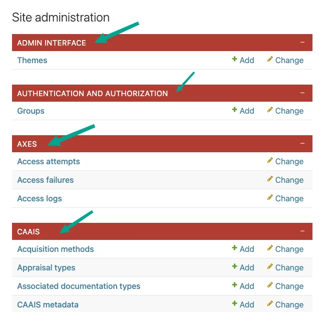

    App modules example

|

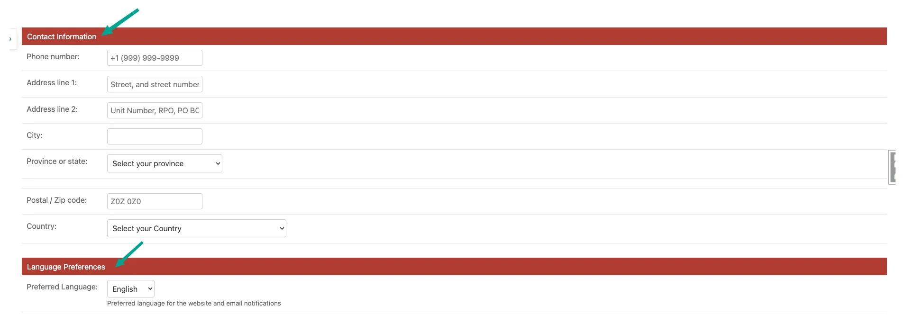

    Fieldsets example

**Background Color**
   Hex color code for module box backgrounds

**Background Selected Color**
   Hex color code for selected/active module backgrounds

**Text Color**
   Hex color code for module text

**Link Color**
   Hex color code for module links

**Link Selected Color**
   Hex color code for selected module links

**Link Hover Color**
   Hex color code for module links on hover

**Rounded Corners**
   Checkbox to enable/disable rounded corners on module boxes

Generic Links
~~~~~~~~~~~~~

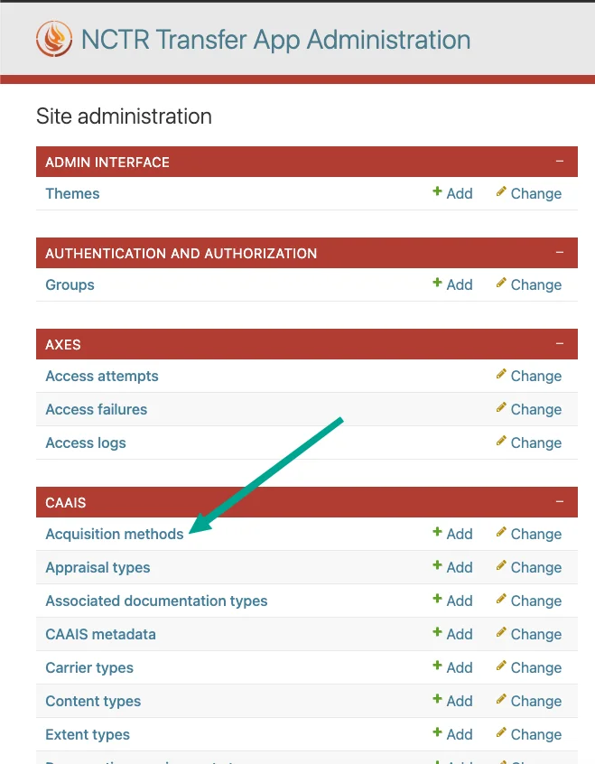

    Generic links example 1

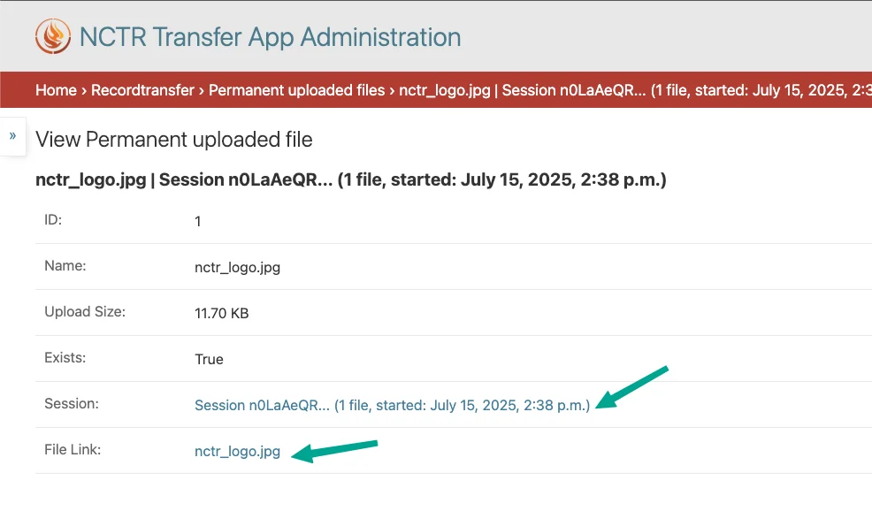

    Generic links example 2

**Link Color**
    Hex color code for general links throughout the admin

**Link Hover Color**
    Hex color code for general links on hover

**Link Active Color**
    Hex color code for active/clicked links

Save Button
~~~~~~~~~~~

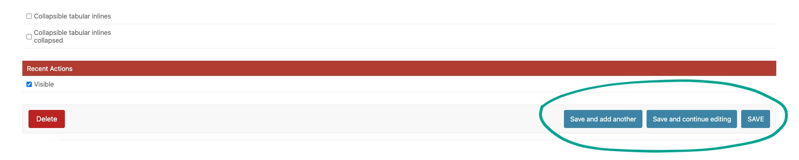

**Background Color**
    Hex color code for save button backgrounds

**Background Hover Color**
    Hex color code for save buttons on hover

**Text Color**
    Hex color code for save button text

Delete Button
~~~~~~~~~~~~~

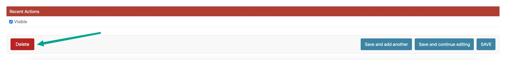

**Background Color**
    Hex color code for delete button backgrounds

**Background Hover Color**
    Hex color code for delete buttons on hover

**Text Color**
    Hex color code for delete button text

Navigation Bar
~~~~~~~~~~~~~~

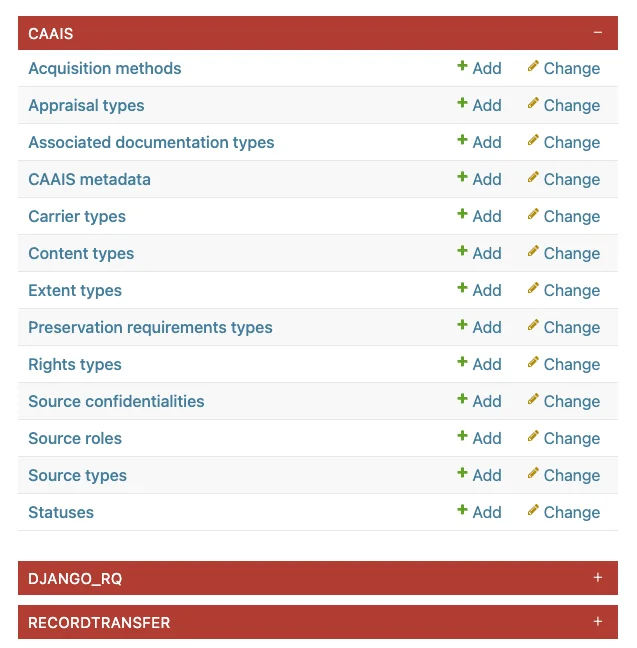

**Foldable apps**
   Checkbox to allow collapsing/expanding app sections

Related Objects Modal
~~~~~~~~~~~~~~~~~~~~~

**Active**
    Checkbox to enable/disable modal popups for related object editing.

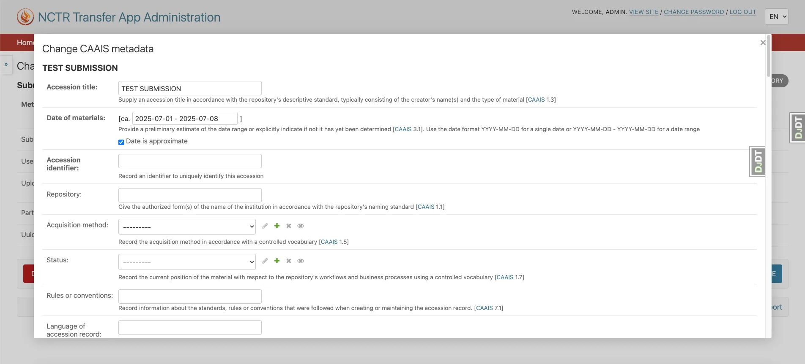

    When related modal is enabled, editing objects opens in a modal popup.

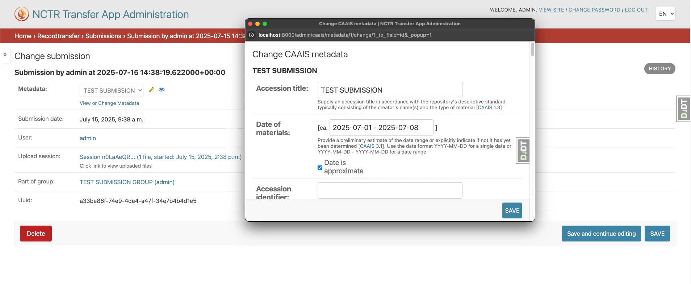

    When related modal is disabled, editing objects opens in a new window.

**Background Color**
   Hex color code for the modal background overlay

**Background Opacity**
   Decimal value for background transparency

**Rounded Corners**
   Checkbox to enable rounded corners on modal windows

**Close Button Visible**
   Checkbox to show/hide the close button on modals

Form Controls
~~~~~~~~~~~~~

**Sticky Submit**
    When enabled, form submit buttons (e.g., "Save", "Delete") will stick to the bottom of the screen when scrolling.

    .. image:: images/admin_theme_sticky_submit_example.webp
        :alt: Example of sticky submit buttons in admin interface

**Sticky Pagination**
    When enabled, pagination controls will stick to the bottom of the screen when scrolling.

    .. image:: images/admin_theme_sticky_pagination_example.webp
        :alt: Example of sticky pagination controls in admin interface

List Filter
~~~~~~~~~~~

**Highlight**
    Checkbox to enable highlighting of active filters

    .. image:: images/admin_theme_list_filter_highlight_example.webp
        :alt: Example of highlighted active filters in admin interface

**Dropdown**
    Checkbox to use dropdown style for filters instead of default links

    .. image:: images/admin_theme_list_filter_dropdown_example.webp
        :alt: Example of dropdown style filters in admin interface

**Sticky**
    Checkbox to make filters stick to the top when scrolling

**Removal Links**
    Checkbox to show "x" links for removing individual filters

    .. image:: images/admin_theme_list_filter_removal_links_example.webp
        :alt: Example of filter removal links in admin interface

Change Form
~~~~~~~~~~~

**Fieldsets as tabs**
    Checkbox to display form fieldsets as tabs instead of sections

    .. image:: images/admin_theme_fieldsets_as_tabs_example.webp
         :alt: Example of fieldsets displayed as tabs in admin interface

**Inlines as tabs**
    Checkbox to display inline forms as tabs

    .. image:: images/admin_theme_inlines_as_tabs_example.webp
         :alt: Example of inline forms displayed as tabs in admin interface

Recent Actions
~~~~~~~~~~~~~~

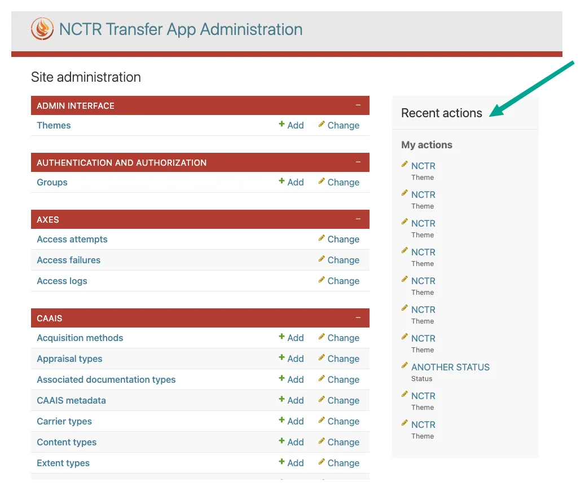

**Visible**
   Checkbox to show/hide the recent actions sidebar on the admin home page