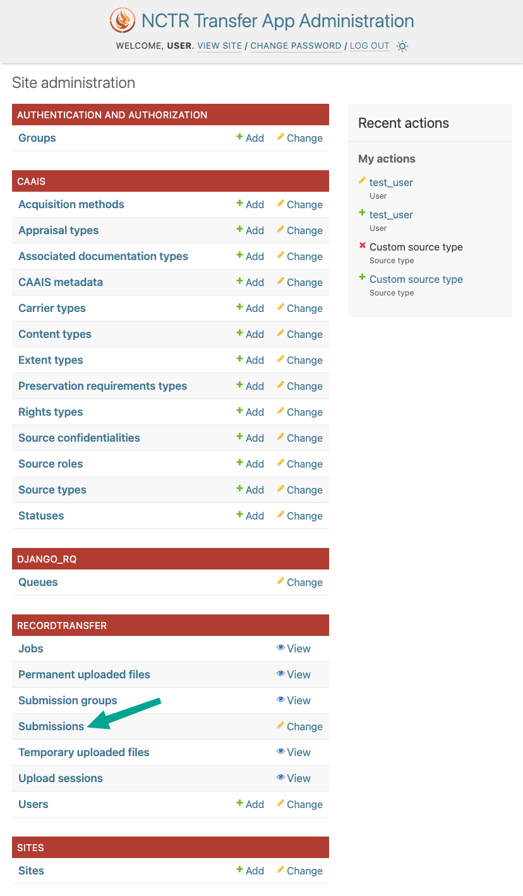
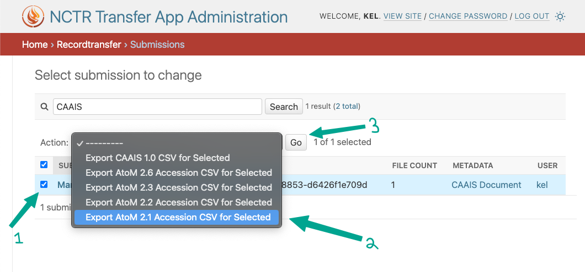
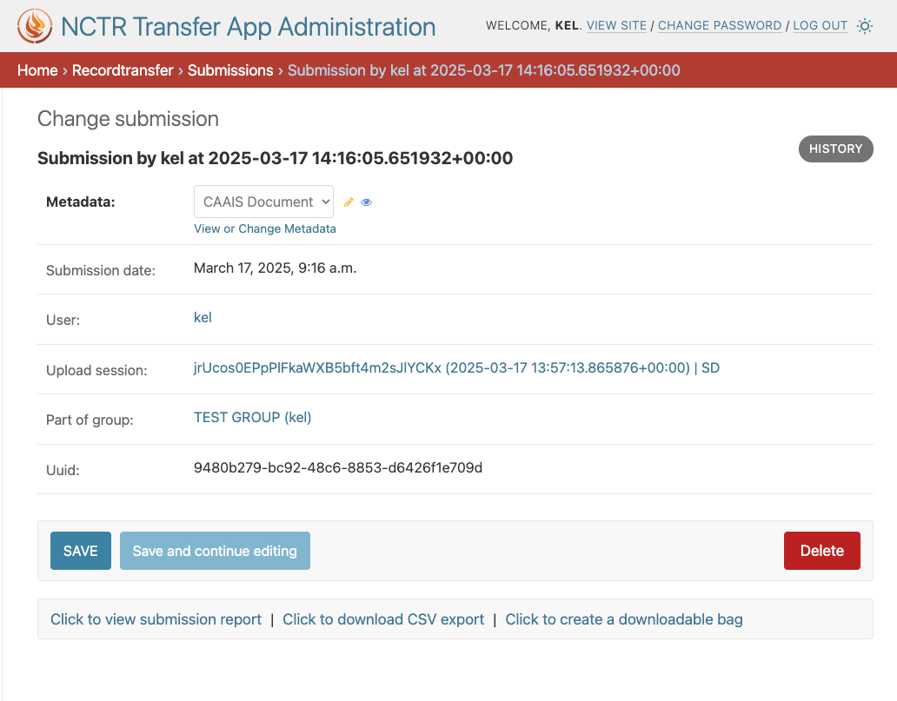
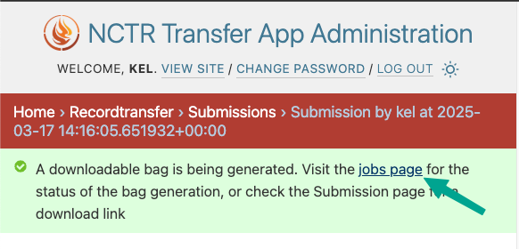
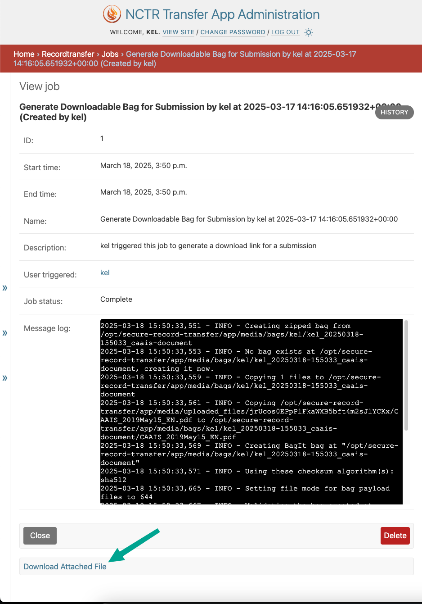

Managing Submissions
====================
Submissions made by donors through the Submission Form can be managed by staff members in the
administrator application. To access the submissions, click on **Submissions** in the admin home
page.

A list of all submissions will appear, with the most recent submissions at the top. To look for a 
specific submission, use the search bar at the top of the page. You can search by the donor's 
username or email, the submission's accession title, or the submission's UUID.

.. image:: images/admin_search_submissions.png
    :alt: Search bar in admin submissions page

To export a submission as a CSV, select the checkbox next to the submission you want to export,
choose the format/version you want to export to, and click the **Go** button. You can select
multiple submissions at once to export them as a single CSV. Note that the CSV export will only
include text fields and not the uploaded files.

To view additional information about a submission, click on the submission's date. This will take
you to the submission's detail page, where you can find additional details about the submission,
such as the submission group that the submission is a part of (if one was assigned).

At the bottom of the submission detail page, you can find links for additional actions.

To view a report of the submission, click on **Click to view submission report**. This will open up
a new tab with a report of the submission, formatted in accordance with CAAIS. This same report is
available to the user who made the submission, on their Profile page.

A CSV of the submission can also be downloaded from here by clicking on **Click to download CSV
export**. CAAIS 1.0 is the default format used for the CSV export here, but you can choose to
export for a version of AtoM from the Submissions page.

To generate and download a BagIt package of the submission, click on **Click to download bag**.
This will start a job that will run in the background to create the BagIt package. You should see
a message at the top of the page indicating that the bag is being created. To check on the status
of the bag creation, click on the **jobs page** link included within the message. 

The time it takes to create the bag will depend on the size of the files included in the
submission, but most bags should be created almost instantly. Once the status of the job shows as
**Complete**, you can click on the job name to view the job details.

On the job details page, you can download the generated BagIt bag by clicking on **Download
Attached File**.

