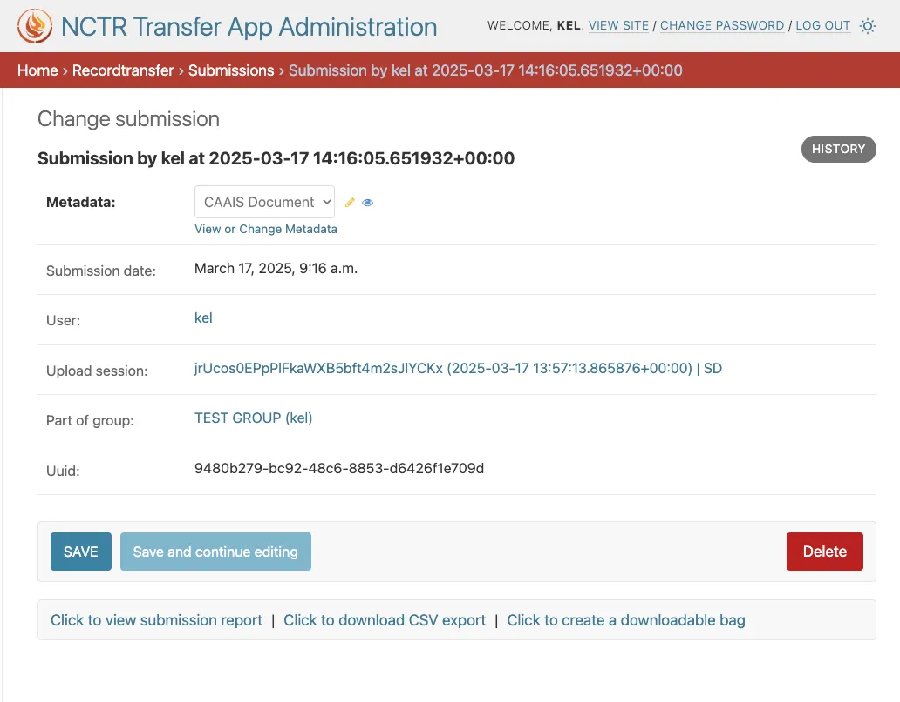

Managing Submissions
====================
Submissions made by donors through the Submission Form can be managed by staff members in the
administrator application. To access the submissions, click on **Submissions** in the admin home
page.

To view the details of a submission, click on the submission's date. This will take you to the
submission's detail page, where you can find additional details about the submission, as well as
additional actions that can be taken.

Searching Submissions
---------------------
On the Submissions admin page, you will find a table of all existing submissions, with the most
recent submissions at the top. To look for a specific submission, use the search bar at the top of
the page. You can search by:

* The donor's username or email
* The submission's accession title
* The submission's UUID

View Report of a Submission
---------------------------
To view a report of the submission, firstly navigate to the submission's detail page. From there,
click on **Click to view submission report** at the bottom of the page.

This will open up a new tab with a report of the submission, formatted in accordance with CAAIS.
This same report is available to the user who made the submission, on their :ref:`Profile page <Past Submissions>`.

Exporting CSVs for Submissions
------------------------------
From the Submissions admin page, you can export submission data as CSV files. Simply select the
checkbox next to one or more submissions you want to export, choose your desired format/version
from the dropdown menu, and click the **Go** button. Selecting multiple submissions will be compile
all submission data in a single CSV file.

.. note::
    CSV exports will only include text fields and not the uploaded files. To download the files
    associated with a submission, you will need to :ref:`generate a BagIt bag
    <Generating BagIt Bag for Submissions>`.

A CSV of the submission can also be downloaded from the submission detail page by clicking on
**Click to download CSV export**. Note that CAAIS 1.0 is the default format used for the CSV export
with this method.

Generating BagIt Bag for Submissions
------------------------------------
To generate and download a BagIt bag for a submission, firstly navigate to the submission's detail
page. From there, click on **Click to create downloadable bag**. 

This starts a job that runs in the background to create the BagIt bag. You should see a message at
the top of the page indicating that the bag is being created. To check on the status of the bag
creation, click on the **jobs page** link included within the message. 

The time it takes to create the bag depends on the size of the files included in the submission,
but most bags are created almost instantly. Once the status of the job shows as **Complete**, click
on the job name to view the job details.

On the job details page, you can download the generated BagIt bag by clicking on **Download
Attached File**.

.. image:: images/admin_bag_download.webp
    :alt: Download BagIt package

Viewing and Editing Submission Metadata
---------------------------------------
To view and edit the metadata associated with a submission, navigate to the submission's detail
page. From there, click on **View or Change Metadata**.

This opens up a change form where you can view and modify the metadata associated with the
submission. Once you have made your changes, click on **SAVE** at the bottom of the page to save
your changes.

