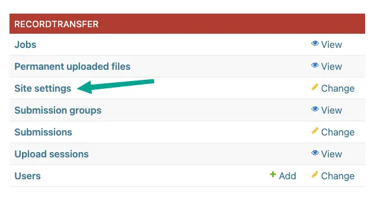
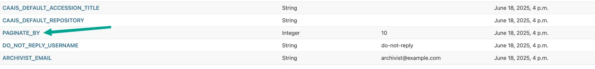
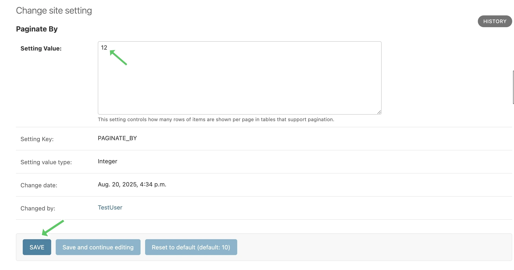
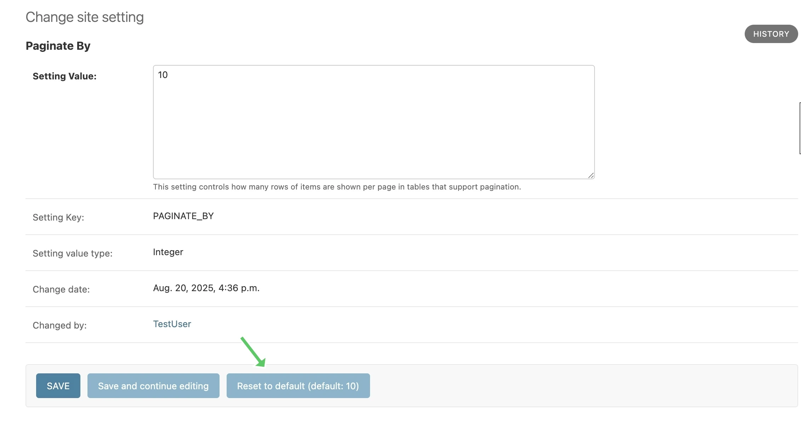
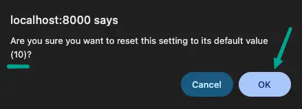

Site Settings
=============

The NCTR Secure Record Transfer application allows administrators to configure various
settings through the Django admin interface without requiring code changes. These
settings control default values for metadata fields, email configurations, and other
application behaviors.

.. note::
   **Site settings vs. Environment variables:** The settings documented here are
   different from the environment variables documented in :doc:`../settings/index`.
   Site settings can be changed through the admin interface and take effect immediately
   without requiring application restart or redeployment. Environment variables, on the
   other hand, require modifying ``.env`` files and restarting the application.

Accessing Site Settings
-----------------------

To access and modify site settings:

1. Log in to the Django admin interface at ``/admin/``

2. Navigate to **Record Transfer** → **Site Settings**

3. Click on the setting you want to modify

4. Update the **Value** field with your desired configuration

5. Click **Save** to apply the changes

Resetting to Default
--------------------
To reset a site setting to its default value, on the edit page, simply click on the
**Reset to Default** button. This will restore the setting to its original value as defined
in the application code.

A confirmation dialog will appear to ensure you want to proceed with the reset, which will include the default value for the setting. Click **OK** to confirm.

.. note::
   Only the **Value** field can be modified. The **Key** and **Value Type** fields
   are read-only to maintain system integrity.

.. warning::
   Changes to site settings take effect immediately and may affect the behavior
   of the application for all users. Always test changes in a development
   environment before applying them to production.

Available Settings
------------------

The following settings can be configured through the admin interface:

Email Settings
~~~~~~~~~~~~~~

ARCHIVIST_EMAIL
^^^^^^^^^^^^^^^

**Type:** String

**Default:** ``archivist@example.com``

The email address displayed for people to contact an archivist. This email is shown
to users throughout the application when they need to contact archival staff.

DO_NOT_REPLY_USERNAME
^^^^^^^^^^^^^^^^^^^^^

**Type:** String

**Default:** "do-not-reply"

A username for the application to send "do not reply" emails from. This username is
combined with the site's base URL to create an email address. The URL can be set
from the admin site.

Pagination Settings
~~~~~~~~~~~~~~~~~~~

PAGINATE_BY
^^^^^^^^^^^

**Type:** Integer

**Default:** 10

This setting controls how many rows of items are shown per page in tables that
support pagination. Must be a positive whole number.

CAAIS Default Settings
~~~~~~~~~~~~~~~~~~~~~~

These settings provide default values for various CAAIS (Canadian Archival
Accession Information Standard) metadata fields.

CAAIS_DEFAULT_REPOSITORY
^^^^^^^^^^^^^^^^^^^^^^^^

**Type:** String

**Default:** None

Default value to fill in metadata for CAAIS section 1.1 - Repository.

CAAIS_DEFAULT_ACCESSION_TITLE
^^^^^^^^^^^^^^^^^^^^^^^^^^^^^

**Type:** String

**Default:** None

Default value to fill in metadata for CAAIS section 1.3 - Accession Title.

CAAIS_DEFAULT_ARCHIVAL_UNIT
^^^^^^^^^^^^^^^^^^^^^^^^^^^

**Type:** String

**Default:** None

Default value to fill in metadata for CAAIS section 1.4 - Archival Unit.

.. note::
    While the Archival Unit field is repeatable in CAAIS, it is not possible to
    specify multiple archival unit defaults.

CAAIS_DEFAULT_DISPOSITION_AUTHORITY
^^^^^^^^^^^^^^^^^^^^^^^^^^^^^^^^^^^

**Type:** String

**Default:** None

Default value to fill in metadata for CAAIS section 1.6 - Disposition Authority.

.. note::
    While the Disposition Authority field is repeatable, it is not possible to
    specify multiple disposition authority defaults.

CAAIS_DEFAULT_ACQUISITION_METHOD
^^^^^^^^^^^^^^^^^^^^^^^^^^^^^^^^

**Type:** String

**Default:** None

Default value to fill in metadata for CAAIS section 1.5 - Acquisition Method.

CAAIS_DEFAULT_STATUS
^^^^^^^^^^^^^^^^^^^^

**Type:** String

**Default:** None

Default value to fill in metadata for CAAIS section 1.7 - Status.

Leave empty, or populate with a term like 'Waiting for review' to signify that
the metadata has not been reviewed yet.

CAAIS_DEFAULT_SOURCE_CONFIDENTIALITY
^^^^^^^^^^^^^^^^^^^^^^^^^^^^^^^^^^^^

**Type:** String

**Default:** None

Default value to fill in metadata for CAAIS section 2.1.6 - Source Confidentiality.

If a default is supplied, the source confidentiality will be applied to every
source of material received.

CAAIS_DEFAULT_PRELIMINARY_CUSTODIAL_HISTORY
^^^^^^^^^^^^^^^^^^^^^^^^^^^^^^^^^^^^^^^^^^^

**Type:** String

**Default:** None

Default value to fill in metadata for CAAIS section 2.2 - Preliminary Custodial History.

.. note::
    While the Preliminary Custodial History field is repeatable in CAAIS, it is not
    possible to specify multiple defaults here.

CAAIS_DEFAULT_DATE_OF_MATERIALS
^^^^^^^^^^^^^^^^^^^^^^^^^^^^^^^

**Type:** String

**Default:** None

Default value to fill in metadata for CAAIS section 3.1 - Date of Materials.

CAAIS_DEFAULT_EXTENT_TYPE
^^^^^^^^^^^^^^^^^^^^^^^^^

**Type:** String

**Default:** None

Default value to fill in metadata for CAAIS section 3.2.1 - Extent Type.

If a default is supplied, the extent type will be applied to every extent
statement received.

CAAIS_DEFAULT_QUANTITY_AND_UNIT_OF_MEASURE
^^^^^^^^^^^^^^^^^^^^^^^^^^^^^^^^^^^^^^^^^^

**Type:** String

**Default:** None

Default value to fill in metadata for CAAIS section 3.2.2 - Quantity and Unit of Measure.

If a default is supplied, the quantity and unit of measure will be applied to every
extent statement received.

CAAIS_DEFAULT_CONTENT_TYPE
^^^^^^^^^^^^^^^^^^^^^^^^^^

**Type:** String

**Default:** None

Default value to fill in metadata for CAAIS section 3.2.3 - Content Type.

If a default is supplied, the content type will be applied to every extent
statement received.

CAAIS_DEFAULT_CARRIER_TYPE
^^^^^^^^^^^^^^^^^^^^^^^^^^

**Type:** String

**Default:** None

Default value to fill in metadata for CAAIS section 3.2.4 - Carrier Type.

If a default is supplied, the carrier type will be applied to every extent
statement received.

CAAIS_DEFAULT_EXTENT_NOTE
^^^^^^^^^^^^^^^^^^^^^^^^^

**Type:** String

**Default:** None

Default value to fill in metadata for CAAIS section 3.2.5 - Extent Note.

If a default is supplied, the extent note will be applied to every extent
statement received.

CAAIS_DEFAULT_PRELIMINARY_SCOPE_AND_CONTENT
^^^^^^^^^^^^^^^^^^^^^^^^^^^^^^^^^^^^^^^^^^^

**Type:** String

**Default:** None

Default value to fill in metadata for CAAIS section 3.3 - Preliminary Scope and Content.

.. note::
    While the Preliminary Scope and Content field is repeatable in CAAIS, it is not
    possible to specify multiple defaults here.

CAAIS_DEFAULT_LANGUAGE_OF_MATERIAL
^^^^^^^^^^^^^^^^^^^^^^^^^^^^^^^^^^

**Type:** String

**Default:** None

Default value to fill in metadata for CAAIS section 3.4 - Language of Material.

CAAIS_DEFAULT_STORAGE_LOCATION
^^^^^^^^^^^^^^^^^^^^^^^^^^^^^^

**Type:** String

**Default:** None

Default value to fill in metadata for CAAIS section 4.1 - Storage Location.

CAAIS_DEFAULT_PRESERVATION_REQUIREMENTS_TYPE
^^^^^^^^^^^^^^^^^^^^^^^^^^^^^^^^^^^^^^^^^^^^

**Type:** String

**Default:** None

Default value to fill in metadata for CAAIS section 4.3.1 - Preservation Requirements Type.

If not empty, a default preservation requirements statement will be applied to each
submission.

CAAIS_DEFAULT_PRESERVATION_REQUIREMENTS_VALUE
^^^^^^^^^^^^^^^^^^^^^^^^^^^^^^^^^^^^^^^^^^^^^

**Type:** String

**Default:** None

Default value to fill in metadata for CAAIS section 4.3.2 - Preservation Requirements Value.

If not empty, a default preservation requirements statement will be applied to each
submission.

CAAIS_DEFAULT_PRESERVATION_REQUIREMENTS_NOTE
^^^^^^^^^^^^^^^^^^^^^^^^^^^^^^^^^^^^^^^^^^^^

**Type:** String

**Default:** None

Default value to fill in metadata for CAAIS section 4.3.3 - Preservation Requirements Note.

If not empty, a default preservation requirements statement will be applied to each
submission.

CAAIS_DEFAULT_APPRAISAL_TYPE
^^^^^^^^^^^^^^^^^^^^^^^^^^^^

**Type:** String

**Default:** None

Default value to fill in metadata for CAAIS section 4.4.1 - Appraisal Type.

If not empty, a default appraisal statement will be applied to each submission.

CAAIS_DEFAULT_APPRAISAL_VALUE
^^^^^^^^^^^^^^^^^^^^^^^^^^^^^

**Type:** String

**Default:** None

Default value to fill in metadata for CAAIS section 4.4.2 - Appraisal Value.

If not empty, a default appraisal statement will be applied to each submission.

CAAIS_DEFAULT_APPRAISAL_NOTE
^^^^^^^^^^^^^^^^^^^^^^^^^^^^

**Type:** String

**Default:** None

Default value to fill in metadata for CAAIS section 4.4.3 - Appraisal Note.

If not empty, a default appraisal statement will be applied to each submission.

CAAIS_DEFAULT_ASSOCIATED_DOCUMENTATION_TYPE
^^^^^^^^^^^^^^^^^^^^^^^^^^^^^^^^^^^^^^^^^^^

**Type:** String

**Default:** None

Default value to fill in metadata for CAAIS section 4.5.1 - Associated Documentation Type.

If not empty, a default associated document will be applied to each submission.

CAAIS_DEFAULT_ASSOCIATED_DOCUMENTATION_TITLE
^^^^^^^^^^^^^^^^^^^^^^^^^^^^^^^^^^^^^^^^^^^^

**Type:** String

**Default:** None

Default value to fill in metadata for CAAIS section 4.5.2 - Associated Documentation Title.

If not empty, a default associated document will be applied to each submission.

CAAIS_DEFAULT_ASSOCIATED_DOCUMENTATION_NOTE
^^^^^^^^^^^^^^^^^^^^^^^^^^^^^^^^^^^^^^^^^^^

**Type:** String

**Default:** None

Default value to fill in metadata for CAAIS section 4.5.3 - Associated Documentation Note.

If not empty, a default associated document will be applied to each submission.

CAAIS_DEFAULT_GENERAL_NOTE
^^^^^^^^^^^^^^^^^^^^^^^^^^

**Type:** String

**Default:** None

Default value to fill in metadata for CAAIS section 6.1 - General Note.

CAAIS_DEFAULT_RULES_OR_CONVENTIONS
^^^^^^^^^^^^^^^^^^^^^^^^^^^^^^^^^^

**Type:** String

**Default:** None

Default value to fill in metadata for CAAIS section 7.1 - Rules or Conventions.

CAAIS_DEFAULT_LANGUAGE_OF_ACCESSION_RECORD
^^^^^^^^^^^^^^^^^^^^^^^^^^^^^^^^^^^^^^^^^^

**Type:** String

**Default:** None

Default value to fill in metadata for CAAIS section 7.3 - Language of Accession Record.

CAAIS Event Default Settings
~~~~~~~~~~~~~~~~~~~~~~~~~~~~

These settings control the default values for events that are automatically created
when submissions are received.

CAAIS_DEFAULT_SUBMISSION_EVENT_TYPE
^^^^^^^^^^^^^^^^^^^^^^^^^^^^^^^^^^^

**Type:** String

**Default:** "Transfer Submitted"

Default submission event type name - related to CAAIS section 5.1.1.

At the time of receiving a submission, a 'Submission' type event is created for the
submission. You can control the Event Type name for that event here.

CAAIS_DEFAULT_SUBMISSION_EVENT_AGENT
^^^^^^^^^^^^^^^^^^^^^^^^^^^^^^^^^^^^

**Type:** String

**Default:** None

Default submission event agent - related to CAAIS section 5.1.3.

At the time of receiving a submission, a 'Submission' type event is created for the
submission. You can control the Event Agent's name for that event here.

CAAIS_DEFAULT_SUBMISSION_EVENT_NOTE
^^^^^^^^^^^^^^^^^^^^^^^^^^^^^^^^^^^

**Type:** String

**Default:** None

Default submission event note - related to CAAIS section 5.1.4.

At the time of receiving a submission, a 'Submission' type event is created for the
submission. You can control whether an Event Note is added for the event here.

CAAIS Creation Default Settings
~~~~~~~~~~~~~~~~~~~~~~~~~~~~~~~

These settings control the default values for creation events that are automatically
created when submissions are received.

CAAIS_DEFAULT_CREATION_TYPE
^^^^^^^^^^^^^^^^^^^^^^^^^^^

**Type:** String

**Default:** "Creation"

Default date of creation event name - related to CAAIS section 7.2.1.

At the time of receiving a submission, a Date of Creation or Revision is created to
indicate the date the accession record was created. You can control the name of the
event here if you do not want to call it 'Creation'.

CAAIS_DEFAULT_CREATION_AGENT
^^^^^^^^^^^^^^^^^^^^^^^^^^^^

**Type:** String

**Default:** None

Default date of creation event agent - related to CAAIS section 7.2.3.

At the time of receiving a submission, a Date of Creation or Revision is created to
indicate the date the accession record was created. You can control the name of the
event agent here.

CAAIS_DEFAULT_CREATION_NOTE
^^^^^^^^^^^^^^^^^^^^^^^^^^^

**Type:** String

**Default:** None

Default date of creation event note - related to CAAIS section 7.2.4.

At the time of receiving a submission, a Date of Creation or Revision is created to
indicate the date the accession record was created. You can add a note to that event
here by setting the value to something other than an empty string.

Settings Validation
-------------------

The application performs validation on setting values to ensure data integrity:

**String Settings:**
- Must contain non-empty text
- Leading and trailing whitespace is preserved

**Integer Settings:**
- Must be valid whole numbers
- For pagination settings, must be positive numbers greater than zero

**Email Settings:**
- Must be valid email addresses (for :ref:`ARCHIVIST_EMAIL`)

.. seealso::

    For information on adding new settings programmatically, see the developer
    documentation at :class:`~recordtransfer.models.SiteSetting`.
