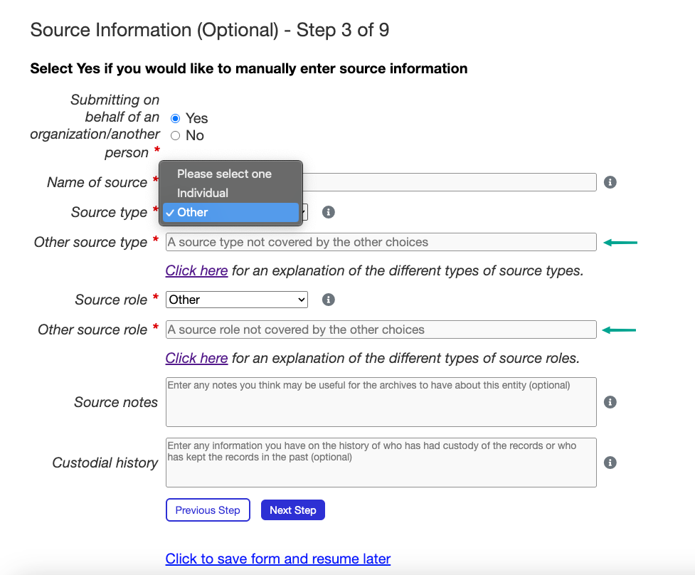

The Submission Form
===================

The Submission Form serves as the heart of the public-facing application, where metadata about
records can be provided by donors and files can be uploaded for transfer to the institution.

A submission can be initiated by clicking on either "Submit" on the navigation bar or the "Submit
Your Records" button on the homepage. This will take the donor to the submission form.

.. image:: images/access_submission_form.png
    :alt: How to access the submission form

Form Overview
#############

The Submission Form is divided into multiple steps to simplify the submission process. At the
bottom of each step, navigation buttons, **Next Step** and **Previous Step** can be found to move
through the form. "Click to save form and resume later" can also be clicked to save progress and
return to the form at a later time.

.. image:: images/form_navigation.png
    :alt: Navigation buttons on the submission form

For every step of the Submission Form, the data entered is saved so the donor can navigate back and
forward in the form without losing their data. This includes file uploads in
:ref:`Step 8: Upload Files`, which are saved on the server upon selection.

Throughout the form, grey information icons (i) exist next to many fields. Helpful tooltips with
additional guidance on how to complete each field are displayed when the mouse hovers over these
icons.

.. image:: images/mouse_over_help_icon.png
    :alt: Help icons on the submission form

Fields marked with a red asterisk (*) are required. These fields must be completed before
proceeding to the next step of the form. The rest of the fields are optional.

Certain fields are validated after the **Next Step** button is clicked. If any required fields have
been missed or invalid data has been entered, error messages will be shown on top of each relevant
field. These errors prevent the donor from proceeding to the next step until they are corrected.

.. image:: images/form_error.png
    :alt: Error message on the submission form

Step 1: Legal Agreement
#######################

To fill out the form, the legal agreement must first be accepted. This agreement outlines the legal
terms and conditions that the donor must agree to before continuing with the rest of the form.

.. image:: images/transfer_step_1.png
    :alt: Step 1 of the submission form

Step 2: Contact information
###########################

This step gathers contact information from the donor.

Step 3: Source information
##########################

Here, the donor inputs information about who is submitting the records. If the donor is submitting
records themselves, they can leave the default "No" selected for the "Submitting on behalf of an
organization/another person" field and simply click **Next Step**.

If the donor is submitting the records on behalf of another person or an institution, they can
select "Yes" for that field instead. This will reveal additional fields where they can provide 
information about the organization or person they are submitting the records for. CAAIS includes
fields for adding notes about the source, as well as custodial history. If the donor feels inclined
to include this information, they can do so in the relevant optional fields.

.. image:: images/transfer_step_3_on_behalf.png
    :alt: Step 3 of the submission form, submitting on behalf of another person or organization

If the relevant source role or source type is not present in the dropdown, the donor can select
"Other" for either field and a text box will appear where they can enter their own source type or
role.

Step 4: Record Description
##########################

In this step, the donor is asked for a very brief description of their transfer/records. They must
enter four pieces of information:

- A title
- The start and end date of the records

    * If the records span only a single date, the donor can select just one date
    * They can select "Date is approximated" if the date is not exact, or if they are not sure of
    the exact date
- The languages of the records
- A brief description of what the records contain

.. image:: images/transfer_step_4.png
    :alt: Step 4 of the submission form

By default, a date widget is used to select the start and end dates. To allow donors to enter dates
manually, the date widget can be disabled by modifying :ref:`USE_DATE_WIDGETS`.

Step 5: Record Rights
#####################

Here, the donor will enter the rights applying to their records. They must select at least one type
of rights that apply to their records. If the type is not present in the dropdown, they can select
Other and type in their own type of right. If they want to add multiple rights if, for example,
there are different rights for different records, they can click the **+ Add** button to add more.
Alternately, they can remove rights with the **- Remove** button.

If the donor is unsure about which right/(s) apply for their records, they can click on a link
found at the top of the form, which will open up a description for each type of right on a new tab.
More information about the rights in this step can be found on :ref:`Adding Rights Taxonomies`.

.. image:: images/transfer_step_5.png
    :alt: Step 5 of the submission form

Step 6: Other Identifiers
#########################

If the donor has other identifiers that apply to their records, such as an ISBN, or a barcode
number, they can put those here. They are not required to enter any here, so can skip to the next
step if needed.

Similar to the Rights form, donors can add or remove identifiers as needed.

.. image:: images/transfer_step_6.png
    :alt: Step 6 of the submission form

Step 7: Assign Submission to Group
################################

If the donor is splitting their submission out into multiple batches, or if they just want to
associate their submission with a group of other submissions they have or will make, they can do so
here. They can select previous groups from the dropdown, or create a new one by clicking on the
**Add New Group** button.

Clicking on the **Add New Group** button will open a modal where the donor can enter a name and
description for the group. 

Step 8: Upload Files
####################

This is where the donor can add files to their submission. They must include at least one file to
make a submission. They can add files to the file drop zone by clicking on "browse files" or by
dragging and dropping files into it. Only accepted file formats can be uploaded.

To see more about how to change what files are accepted, go to the section on
:ref:`ACCEPTED_FILE_FORMATS`.

.. image:: images/transfer_step_8.png
    :alt: Step 8 of the submission form

A preview of an uploaded file can be seen by clicking on its file icon. The donor can also remove
files by clicking on the (x) icon.

Post-Transfer
#############

If the final form submitted successfully, the user will immediately be re-routed to a thank you
page. The submission of the transfer form sets off a chain reaction of events. At a high level,
these things happen:

- A bagit Bag is created on the file system with the user's uploaded files and all of the form
  metadata. The location of this bag depends on what the APP_STORAGE_FOLDER is set to.
- A Bag object in the database is created. When the Bag is changed in the database, the bagit Bag
  on the filesystem is updated to match (provided it hasn't been moved).
- An email is sent to any staff user that has checked the "Gets bag email updates" box.
- An email is sent to the user who submitted the form.
