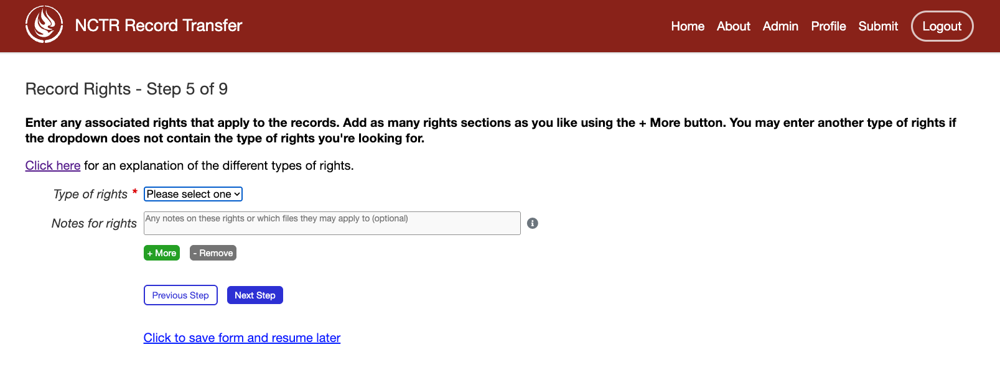
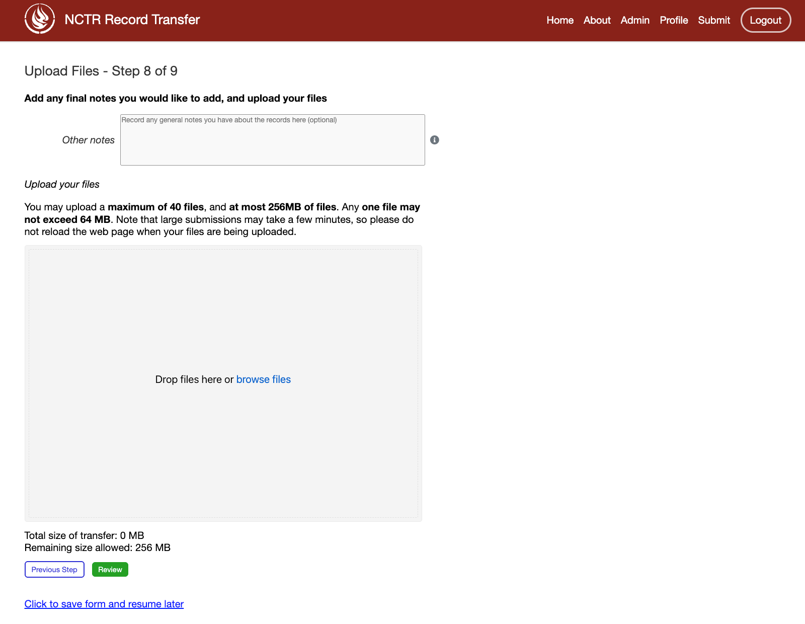

The Submission Form
===================

The Submission Form serves as the heart of the public-facing application, where metadata about
records can be provided by donors and files can be uploaded for transfer to the institution.

A submission can be initiated by clicking on either "Submit" on the navigation bar or the "Submit
Your Records" button on the homepage. This will take the donor to the submission form.

.. image:: images/access_submission_form.png
    :alt: How to access the submission form

Form Guide
###############

The submission form is divided into multiple steps to simplify the submission process. At the
bottom of each step, navigation buttons, **Next Step** and **Previous Step** can be found to move
through the form. "Click to save form and resume later" can also be clicked to save progress and
return to the form at a later time.

.. image:: images/form_navigation.png
    :alt: Navigation buttons on the transfer form

Throughout the form, grey question mark icons (i) exist next to many fields. Helpful tooltips with
additional guidance on how to complete each field are displayed when the mouse hovers over these
icons.

.. image:: images/mouse_over_help_icon.png
    :alt: Help icons on the transfer form

Fields marked with a red asterisk (*) are required. These fields must be completed before
proceeding to the next step of the form. The rest of the fields are optional.

Certain fields are validated after the **Next Step** button is clicked. If any required fields have
been missed or invalid data has been entered, error messages will be shown on top of each relevant
field. These errors prevent the donor from proceeding to the next step until they are corrected.

.. image:: images/form_error.png
    :alt: Error message on the transfer form

Step 1: Legal Agreement
#######################

To fill out the form, the legal agreement must first be accepted. This agreement outlines the legal
terms and conditions that the donor must agree to before continuing with the rest of the form.

Step 2: Contact information
###########################

This step gathers contact information from the donor.

.. image:: images/transfer_step_2.png
    :alt: Step 2 of the transfer form

Step 3: Source information
##########################

Here, the donor inputs information about who is submitting the records. If the donor is submitting
records themselves, they can leave the default "No" selected for the "Submitting on behalf of an
organization/another person" field and simply click **Next Step**.

.. image:: images/transfer_step_3_not_on_behalf.png
    :alt: Step 3 of the transfer form, not submitting on behalf of another person or organization

If they are submitting the records on behalf of another person or an institution, they can select
"Yes" for that field instead. This will reveal additional fields where they can provide 
information about the organization or person they are submitting the records for. CAAIS includes
fields for adding notes about the source, as well as custodial history. If the donor feels inclined
to include this information, they can do so in the relevant optional fields.

Step 4: Record Description
##########################

In this step, the donor is asked for a very brief description of their transfer/records. They must
enter four pieces of information:

- A title
- The start and end date of the records. They can select "Estimated date" if the date is not exact
- The languages of the records
- A brief description of what the records contain

Step 5: Record Rights
#####################

Here, the user will enter the rights applying to their records. They must select at least one type
of rights that apply to their records. If the type is not present in the dropdown, they can select
Other and type in their own type of right. If they want to add multiple rights if, for example,
there are different rights for different records, they can click the **+ Add** button to add more.
Alternately, they can remove rights with the **- Remove** button.

If someone is confused about what the rights are for their records, they can open the rights
explanation dialog for a description for each type of right. You can find more information about the
rights in the section on :ref:`Adding Rights Taxonomies`.

Step 6: Other Identifiers
#########################

If the user has other identifiers that apply to their records, like an ISBN, or a barcode number,
they can put those here. They are not required to enter any here, so can skip to the next step if
needed.

Similar to the Rights form, users can add or remove sections of this form.

Step 7: Assign Transfer to Group
################################

If a user is splitting their transfer out into multiple steps, or if they just want to associate
their transfer with a group of other transfers they have or will make, they can do so here. They can
select previous groups from the dropdown, or add a new one with **-- Add New Group --**.

.. image:: images/transfer_step_7.png
    :alt: Step 7 of the transfer form

Step 8: Upload Files
####################

This is where the user can add files to their transfer. They must send at least one file for the
transfer to submit. They can add files to the file drop zone by clicking on it or by dragging and
dropping files into it. If they add a file that isn't accepted by your accepted file types, the
transfer will not be allowed to submit until they remove the offending files.

To see more about how to change what files are accepted, go to the section on
:ref:`ACCEPTED_FILE_FORMATS`.

.. note::

    For all other steps of the transfer form, the data entered is saved so users can bounce back and
    forward in the form without losing their data. Unfortunately, if a user adds files to the upload
    space, goes to a previous step in the form, and comes to the final step again, their files will
    no longer be there.

Post-Transfer
#############

If the final form submitted successfully, the user will immediately be re-routed to a thank you
page. The submission of the transfer form sets off a chain reaction of events. At a high level,
these things happen:

- A bagit Bag is created on the file system with the user's uploaded files and all of the form
  metadata. The location of this bag depends on what the APP_STORAGE_FOLDER is set to.
- A Bag object in the database is created. When the Bag is changed in the database, the bagit Bag
  on the filesystem is updated to match (provided it hasn't been moved).
- An email is sent to any staff user that has checked the "Gets bag email updates" box.
- An email is sent to the user who submitted the form.
