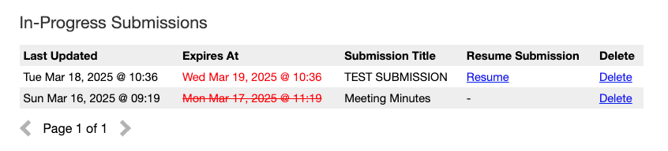
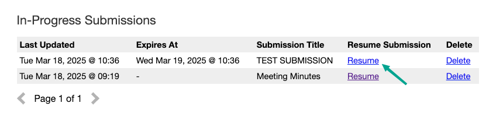
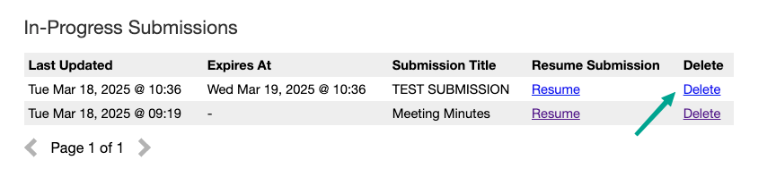
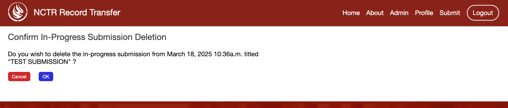
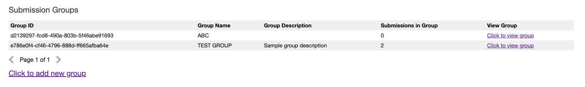
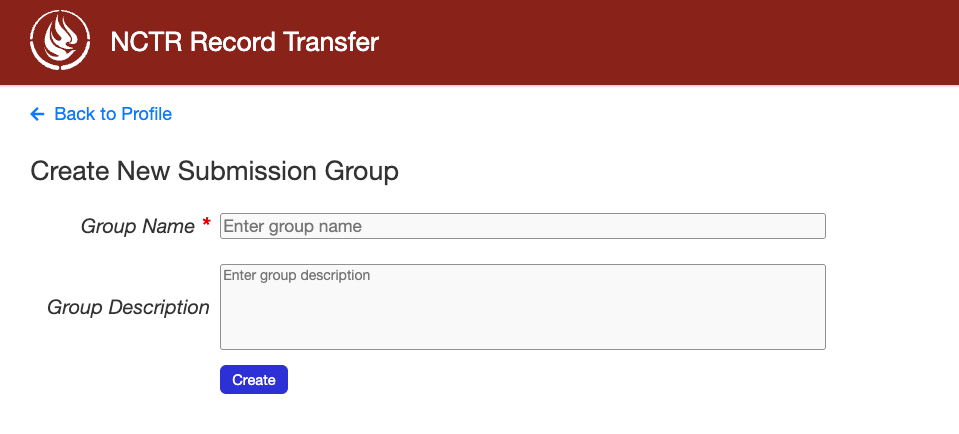
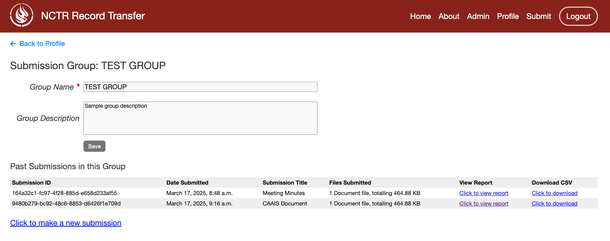

User Profile
============

The user profile page is where users can view and edit their personal information. Users can also
view their past submissions, in-progresss submissions and the submission groups they have created. The
user profile page is accessible by clicking on "Profile" on the navigation bar.

.. image:: images/user_profile_on_navbar.png
    :alt: User profile on the navigation bar

Personal Information
--------------------
In this section of the page, users can view and edit their personal information. This includes
their name, email address and email notification preference. Users can also change their password
here.

The "Receive notification emails?" checkbox allows users to control whether they want to receive
email notifications for new submissions. By default, this checkbox is checked.

.. image:: images/user_profile_personal_info.png
    :alt: User profile personal information

In-Progress Submissions
-----------------------
This section displays a table of all submissions that the user has started but not yet submitted.

.. image:: images/user_profile_in_progress_submissions.png
    :alt: User profile in-progress submissions

The "Submission Title" column displays the title provided by the user in the "Title" field of
:ref:`Step 4: Record Description` of the Submission Form. If that field has not been filled out
yet, the title will be "None".

In-progress submissions with uploaded files will have an expiry date, shown under the "Expires At"
column. This is the date when the in-progress submission will expire if it is not submitted or
updated. Expired in-progress submissions can no longer be resumed or submitted. In-progress
submissions close to expiring will have their expiry date highlighted in red, whereas in-progress
submissions that have already expired will have their expiry date will be both highlighted in red
and striked through.

The length of time before an in-progress submission expires can be configured in the settings. See
:ref:`UPLOAD_SESSION_EXPIRE_AFTER_INACTIVE_MINUTES` and
:ref:`UPLOAD_SESSION_EXPIRED_CLEANUP_SCHEDULE` for more information.

A reminder email will be sent to the user before the in-progress submission expires. The amount of
time before the expiry date that the reminder email is sent can be configured in the settings. See
:ref:`UPLOAD_SESSION_EXPIRING_REMINDER_MINUTES` and
:ref:`IN_PROGRESS_SUBMISSION_EXPIRING_EMAIL_SCHEDULE` for more information.

Resuming an In-Progress Submission
^^^^^^^^^^^^^^^^^^^^^^^^^^^^^^^^^^
Users can resume working on an in-progress submission by clicking on "Resume" for the relevant 
submission in the table. This will take them back to the submission form where they left off.

Once an in-progress submission is submitted, it will no longer appear in this table. Instead, it
will be listed under the :ref:`Past Submissions` section.

Deleting an In-Progress Submission
^^^^^^^^^^^^^^^^^^^^^^^^^^^^^^^^^^
Users can delete an in-progress submission if they no longer wish to complete it. To delete a
submission, click the "Delete" button on the relevant row of the table.

This will take the user to a confirmation page where they can confirm that they want to delete the
in-progress submission. If "OK" is clicked, the in-progress submission and any uploaded files
associated with it will be permanently removed from the system. Clicking on "Cancel" will take the
user back to the Profile page.

After deletion, the submission will no longer appear in the in-progress submissions table.

Past Submissions
----------------
This section displays a table of all submissions that the user has submitted in the past.

.. image:: images/user_profile_past_submissions.png
    :alt: User profile past submissions

The user can view the details of a past submission by clicking on the "Click to view report" button
on the relevant row of the table. This will open up a submission details page for that
submission.

.. image:: images/submission_details.png
    :alt: Submission details

Alternatively, the user can download a CSV file of the submission by clicking on the "Click to
download" button.

Submission Groups
-----------------
This section displays a table of all submission groups that the user has created. Submission groups
that are made by the user during :ref:`Step 7: Assign Submission to Group` of the Submission Form
will be listed here. A new submission group can also be created by clicking on "Click to add new
group" found below the table.

This takes the user to the submission group creation page where they can create a new submission
group.

The user can also view and modify the details of an existing submission group by clicking on the
"Click to view group" button for that group on the table. This will take the user to a page where
they can modify the group name and group description, and also view past submissions made under
this group.

