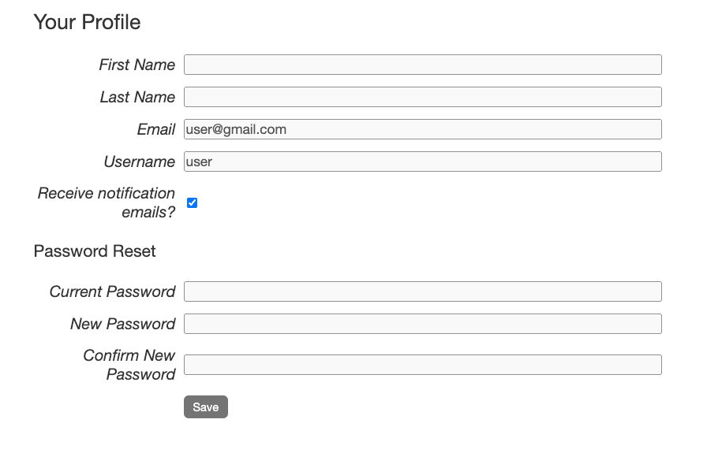
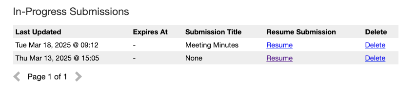
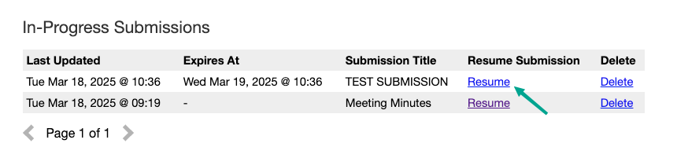

User Profile
============

The user profile page is where users can view and edit their personal information. Users can also
view their past submissions, in-progresss submissions and the submission groups they have created. The
user profile page is accessible by clicking on "Profile" on the navigation bar.

Personal Information
--------------------
In this section of the page, users can view and edit their personal information. This includes
their name, email address and email notification preference. Users can also change their password
here.

The "Receive notification emails?" checkbox allows users to control whether they want to receive
email notifications for new submissions. By default, this checkbox is checked.

In-Progress Submissions
-----------------------
This section displays a table of all submissions that the user has started but not yet submitted.

The "Submission Title" column displays the title provided by the user in the "Title" field of
::ref:`Step 4: Record Description` of the Submission Form. If that field has not been filled out
yet, the title will be "None".

In-progress submissions with uploaded files will have an expiry date, shown under the "Expires At"
column. This is the date when the in-progress submission will expire if it is not submitted or
updated. Expired in-progress submissions can no longer be resumed or submitted.

The length of time before an in-progress submission expires can be configured in the settings. See
::ref:`UPLOAD_SESSION_EXPIRE_AFTER_INACTIVE_MINUTES` and
::ref:`UPLOAD_SESSION_EXPIRED_CLEANUP_SCHEDULE` for more information.

A reminder email will be sent to the user before the in-progress submission expires. The amount of
time before the expiry date that the reminder email is sent can be configured in the settings. See
::ref:`UPLOAD_SESSION_EXPIRING_REMINDER_MINUTES` and
::ref:`IN_PROGRESS_SUBMISSION_EXPIRING_EMAIL_SCHEDULE` for more information.

Resuming an In-Progress Submission
^^^^^^^^^^^^^^^^^^^^^^^^^^^^^^^^^^

Users can resume working on an in-progress submission by clicking on "Resume" for the relevant 
submission in the table. This will take them back to the submission form where they left off.

Once an in-progress submission is submitted, it will no longer appear in this table. Instead, it
will be listed under the "Past Submissions" section.