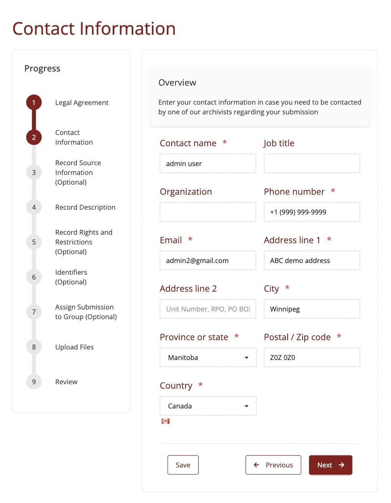
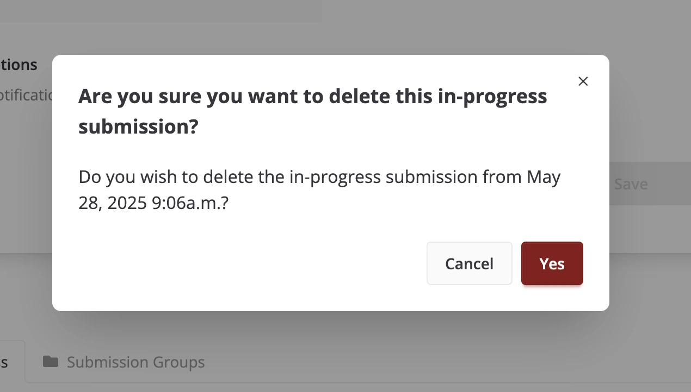
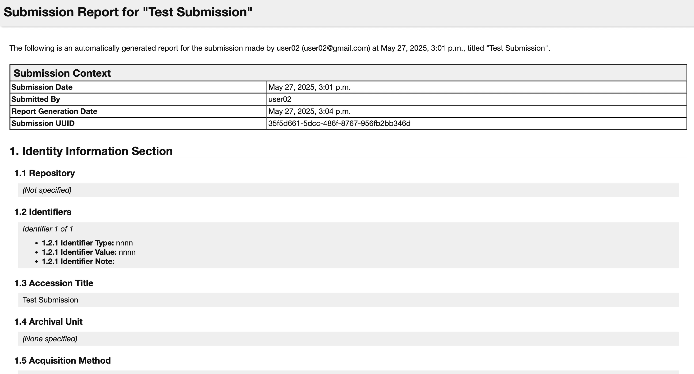

User Profile
============

The user profile page is where users can view and edit their personal information. Users can also
view their past submissions, in-progresss submissions and the submission groups they have created. The
user profile page is accessible by clicking on "Profile" on the navigation bar.

The Profile page has two tabs: "Account" and "Contact Information".

Account Tab
-----------
In the Account tab, users can view and edit their personal information. This includes
their name, email address and email notification preference, however, the email address field is read-only and cannot be changed from the Profile page. Users can also change their password here.

The "Receive notification emails?" checkbox allows users to control whether they want to receive
email notifications for new submissions. By default, this checkbox is checked.

To save changes made to personal information, click on the "Save" button.

Contact Information Tab
-----------------------
The Contact Information tab allows users to store their contact details including phone number and address. This information is stored in your profile for convenience.

To save changes made to contact information, click on the "Save" button.

By completing this information once in your profile, these details will be automatically populated whenever you create a new submission in :ref:`Step 2: Contact information` of the Submission Form.  This saves time for users who make multiple submissions, as they won't need to re-enter their contact information for each submission.

In-Progress Submissions
-----------------------
This section displays a table of all submissions that the user has started but not yet submitted.

The "Submission Title" column displays the title provided by the user in the "Title" field of
:ref:`Step 4: Record Description` of the Submission Form. If that field has not been filled out
yet, the title will be "None".

Expirable in-progress submissions will have an expiry date shown under the "Expires At" column.
This is the date when the in-progress submission will expire if it is not submitted or updated.
Expired in-progress submissions can no longer be resumed or submitted. In-progress submissions
close to expiring will have their expiry date highlighted in red, whereas in-progress submissions
that have already expired will have their expiry date both highlighted in red and striked through.

.. note::
    Only in-progress submissions with uploaded files can expire.

The length of time before an in-progress submission expires can be configured in the settings. See
:ref:`UPLOAD_SESSION_EXPIRE_AFTER_INACTIVE_MINUTES` and
:ref:`UPLOAD_SESSION_EXPIRED_CLEANUP_SCHEDULE` for more information.

A reminder email will be sent to the user before the in-progress submission expires. The amount of
time before the expiry date that the reminder email is sent can be configured in the settings. See
:ref:`UPLOAD_SESSION_EXPIRING_REMINDER_MINUTES` and
:ref:`IN_PROGRESS_SUBMISSION_EXPIRING_EMAIL_SCHEDULE` for more information.

Resuming an In-Progress Submission
^^^^^^^^^^^^^^^^^^^^^^^^^^^^^^^^^^
Users can resume working on an in-progress submission by clicking on the green play icon for the relevant
submission in the table. This will take them back to the submission form where they left off.

Once an in-progress submission is submitted, it will no longer appear in this table. Instead, it
will be listed under the :ref:`Past Submissions` section.

Deleting an In-Progress Submission
^^^^^^^^^^^^^^^^^^^^^^^^^^^^^^^^^^
Users can delete an in-progress submission if they no longer wish to complete it or if it has
expired. To delete a submission, click the trash can icon on the relevant row of the table.

.. image:: images/user_profile_delete_in_progress_submission.webp
    :alt: User profile delete submission

This will open a confirmation dialog where the user can confirm that they want to delete the in-progress submission. If 'Yes' is clicked, the in-progress submission and any uploaded files associated with it will be permanently removed from the system. Clicking on 'Cancel' will close the dialog and keep the user on the Profile page.

After deletion, the submission will no longer appear in the in-progress submissions table.

Past Submissions
----------------
This section displays a table of all submissions that the user has submitted in the past.

.. image:: images/user_profile_past_submissions.webp
    :alt: User profile past submissions

The user can view the details of a past submission by clicking on the blue file icon
on the relevant row of the table. This will open up a submission details page for that
submission.

Alternatively, the user can download a CSV file of the submission by clicking on the green download icon on the relevant row of the table.

Submission Groups
-----------------
This section displays a table of all submission groups that the user has created. Submission groups
that are made by the user during :ref:`Step 7: Assign Submission to Group` of the Submission Form
will be listed here. A new submission group can also be created by clicking on "New submission group +" found below the table.

This takes the user to the submission group creation page where they can create a new submission
group.

The user can also view and modify the details of an existing submission group by clicking on the
blue eye icon for that group in the table on the profile page.

This will take the user to a page where they can modify the group name and group description, and also view past submissions made under this group.

Clicking on "New submission +" takes the user to the Submission Form with the
submission group pre-selected.

You can also click on the red trash icon to remove a submission group.

When you do this, a confirmation dialog box will appear asking if you are sure you want to delete the group.

Click **Yes** to proceed with deleting the submission group. This will remove the group, but any submissions previously associated with it will remain intact, they will simply no longer be associated with any group.

Click **Cancel** if you do not wish to proceed with the deletion. This will close the dialog and return you to the profile page without making any changes.