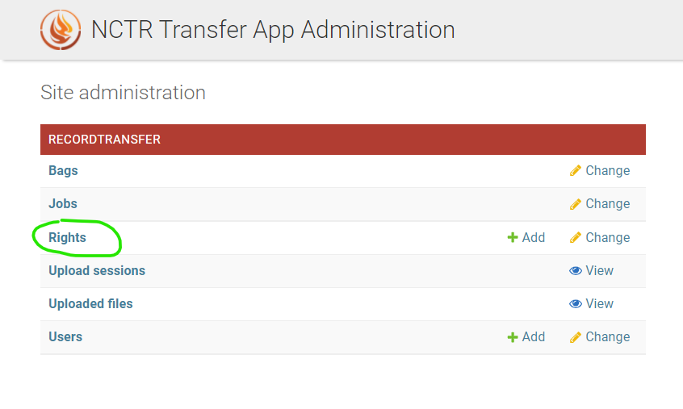
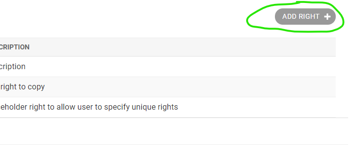
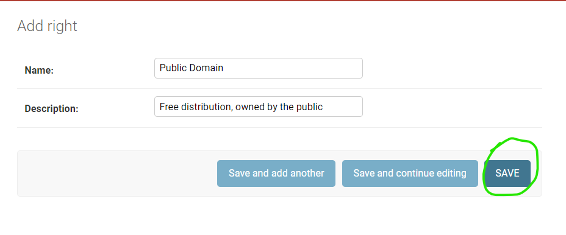
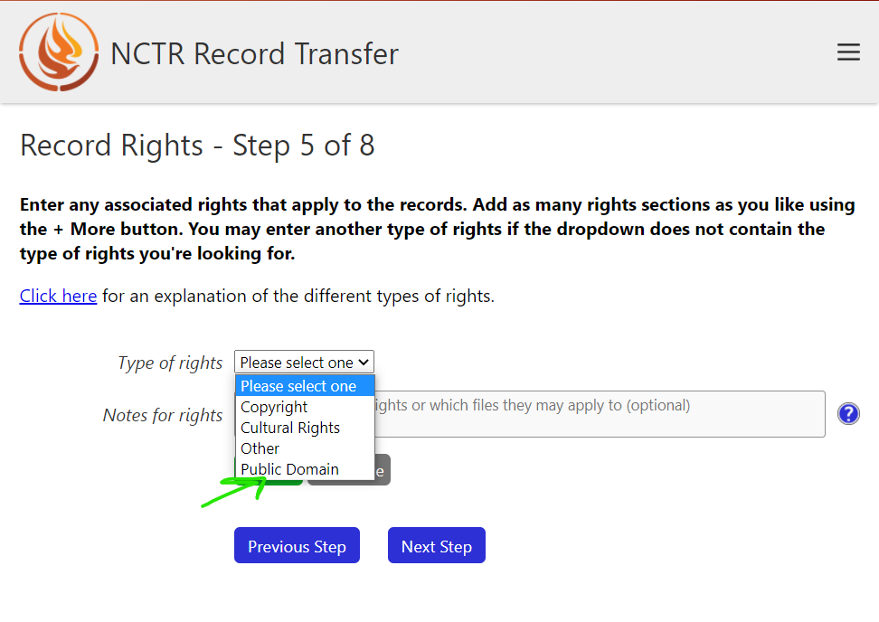
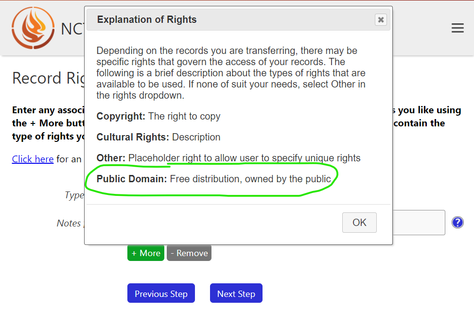

Adding Rights Taxonomies
========================

To be inclusive of different types of rights, the record transfer application allows for the
creation of rights taxonomies. This is a set of terms users can select from when they enter rights
for their transfer. There are no rights taxonomies in the database when the app is first created,
you must add them yourself.

To add new rights, log in to a staff or super user account. Go to the administrator application
(accessible at /admin/), and click on **Rights**.

Next, click **Add Right**.

The name you enter into the **Name:** box will be added to the list of selections in the dropdown
when a user adds rights in the transfer form. The description can be seen in the popup dialog on the
rights step of the transfer form.

Click Save when you are satisfied with the new right.

Now when a user makes it to the right form, the new right (in this case, Public Domain) will show up
in the dropdown.

The right's name and description will also show up in the rights explanation popup.

