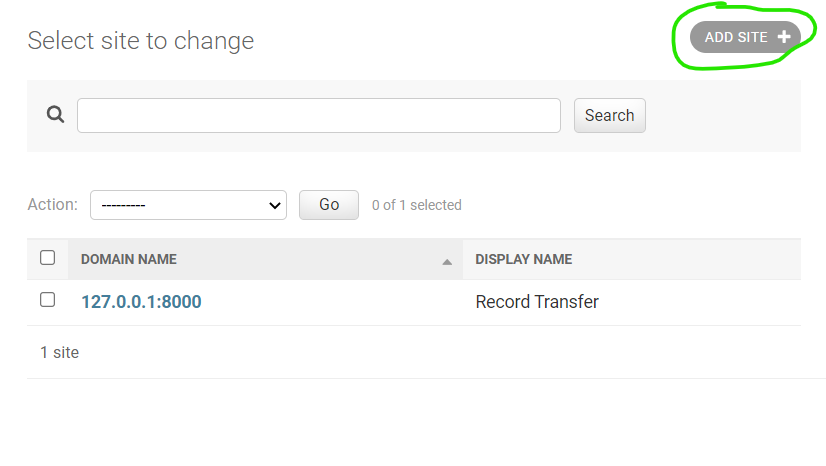
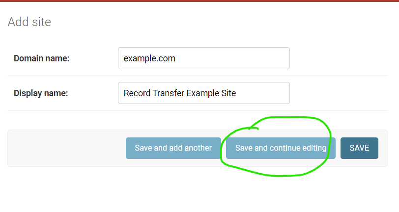

Adding Sites
============

If you are running the record transfer app somewhere other than your localhost, you will need to add
your site's domain to the database. If you do not set the domain, your emails will not send
correctly, and will have the wrong link to your site.

To set the name and domain of your site, first log in as a **superuser**. Regular staff users do not
have permission to modify Sites.

Go to the administrator application (accessible at /admin/), and click on **+ Add** next to **Sites**.

Fill out your domain name, and give the website a name (you can change the name later if you don't
like it). Once filled out, click the blue **Save and continue** button.

Once saved, take a look at the address in the address bar for your new site. You will see something
like /admin/sites/site/**2**/change. The important part to note is the number. This number is the
**SITE_ID**.

To change which site the app uses, you need to change the **SITE_ID** Django setting. This setting
is controlled by the environment variable file. If running with Docker, the environment variable
file is found at:

::

    bagitobjecttransfer/.dockerenv

If running in production using the recommended installation instructions in these docs, the
environment variable file will be here:

::

    /opt/NCTR-Bagit-Record-Transfer/.env

If you want to change to Site 3, the **SITE_ID** should be set like this:

::

    SITE_ID=3
