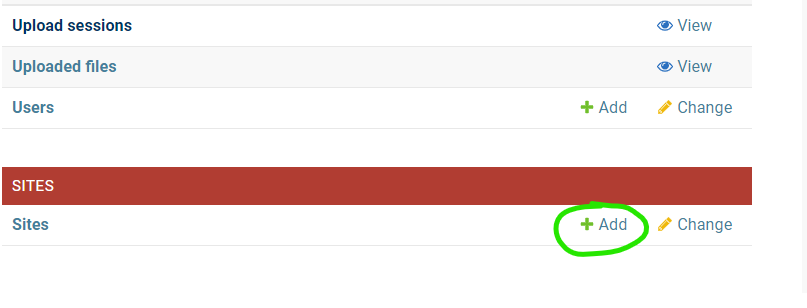

Running the App
===============

It is recommended to run this application with `Docker <https://www.docker.com/>`_ or with
`Podman <https://podman.io/>`_. Both Docker and Podman allow you to run "containerized"
applications.

If you are running Windows, the you will need to make sure that you have
`WSL Enabled <https://learn.microsoft.com/en-us/windows/wsl/install>`_. Docker and Podman both run
*Linux* containers, which require Windows Sub-system for Linux (WSL). Mac and Linux do not require
this step.

If you would like to use Podman, you will also need to install
`Podman Compose <https://github.com/containers/podman-compose>`_, which requires you to have
`Python <https://python.org>`_ installed on your computer.

You might also want `Docker Desktop <https://www.docker.com/products/docker-desktop/>`_ or
`Podman Desktop <https://podman-desktop.io/>`_, since these applications provide a nice visual
interface for interacting with containers.

The following documentation assumes you have either Docker or Podman installed. It is also assumed
that you have rudimentary knowledge of what is required to run a command in a shell.

Development Application
-----------------------

The simplest way to run the application is in "development" mode. This mode uses all local services,
**if you just want to try the application out, follow these steps**.

From the root of the repository, run the following commands before running the application for the
first time.

.. code-block:: bash

    cd bagitobjecttransfer
    cp example.dev.env .dev.env

To start up the application, run one of these commands, depending on whether you are using Docker or
Podman.

.. code-block:: bash

    # If using docker:
    docker compose -f docker-compose.yml -f docker-compose.dev.yml up -d

    # If using podman:
    podman-compose -f docker-compose.yml -f docker-compose.dev.yml up -d

Visit http://localhost:8000 to see the application running.

If you are using `Docker Desktop <https://www.docker.com/products/docker-desktop/>`_ or
`Podman Desktop <https://podman-desktop.io/>`_, you should now see the application and all of its
services running there, too.

The application will not work at first, since the database is not populated. To populate the
database, you can run the following command.

.. code-block:: bash

    # If using docker:
    docker compose -f docker-compose.yml -f docker-compose.dev.yml exec app python manage.py migrate --no-input

    # If using podman:
    podman-compose -f docker-compose.yml -f docker-compose.dev.yml exec app python manage.py migrate --no-input

You will also find that you cannot log in to the application. You can create a new administrator
user by running the following command.

.. code-block:: bash

    # If using docker:
    docker compose -f docker-compose.yml -f docker-compose.dev.yml exec app python manage.py createsuperuser

    # If using podman:
    podman-compose -f docker-compose.yml -f docker-compose.dev.yml exec app python manage.py createsuperuser

The development application uses a simple `MailHog <https://github.com/mailhog/MailHog>`_ server to
intercept messages coming from the application. Visiting http://localhost:8025 when the app is
running allows you to visit the MailHog dashboard, which lets you view all of the emails sent by the
app.

If you would like to create new users via the sign-up page, you can find the account activation
emails in MailHog.

Finding Logs in the Development Application
^^^^^^^^^^^^^^^^^^^^^^^^^^^^^^^^^^^^^^^^^^^

The logging configuration for the application can be found in the file
:code:`bagitobjecttransfer/settings/docker_dev.py`. The logs are written to files, which are mapped
to folders in the repository. The paths in the following table are relative to the path
:code:`bagitobjecttransfer/` from the root of the repository.

.. list-table:: Log Locations for Development Application
    :header-rows: 1

    * - Name of log
      - Log location
    * - App Log
      - :code:`docker/logs/django/recordtransfer.log`
    * - Async Job Queue Log
      - :code:`docker/logs/django-rq/rqworker.log`
    * - Redis Log
      - :code:`docker/logs/redis/redis-server.log`
    * - ClamAV Log
      - :code:`docker/logs/clamav/clamd.log`
        :code:`docker/logs/clamav/freshclam.log`

Debugging the Development Application
^^^^^^^^^^^^^^^^^^^^^^^^^^^^^^^^^^^^^

If you are interested in debugging the application, the ports 8009 and 8010 are exposed to allow you
to debug the web application, and the asynchronous job queue, respectively.

In VS Code, you may create a :code:`launch.json` file with these contents:

.. code-block:: json

    {
        "version": "0.2.0",
        "configurations": [
            {
                "name": "Debug Django",
                "type": "python",
                "request": "attach",
                "pathMappings": [
                    {
                        "localRoot": "${workspaceFolder}/bagitobjecttransfer/",
                        "remoteRoot": "/app/"
                    }
                ],
                "port": 8009,
                "host": "127.0.0.1"
            },
            {
                "name": "Debug RQ",
                "type": "python",
                "request": "attach",
                "pathMappings": [
                    {
                        "localRoot": "${workspaceFolder}/bagitobjecttransfer/",
                        "remoteRoot": "/app/"
                    }
                ],
                "port": 8010,
                "host": "127.0.0.1"
            }
        ]
    }

Production Application
----------------------

The production Docker environment uses Nginx + Gunicorn instead of the Django development server,
and opts to use MySQL instead of SQLite.

From the root of the repository, run the following commands before running the application in
"production mode" for the first time.

.. code-block:: bash

    cd bagitobjecttransfer
    cp example.prod.env .prod.env

The settings in the :code:`.prod.env` file control the application, as well as some other settings
Django loads. Refer to :ref:`recordtransfer.settings - Application Settings` for application
settings, and refer to the file :code:`bagitobjecttransfer/settings/docker_prod.py` for more
settings that can be controlled by the :code:`.prod.env` file. The :code:`example.prod.env` file
contains most of the settings you are likely to be interested in changing.

Similar to the development application, you run the production application using Docker or Podman,
but pass it the production compose file instead.

.. code-block:: bash

    # If using docker:
    docker compose -f docker-compose.yml -f docker-compose.prod.yml up -d

    # If using podman:
    podman-compose -f docker-compose.yml -f docker-compose.prod.yml up -d

After starting the application up, you will need to update the database, and you will need to
`collect static files <https://docs.djangoproject.com/en/4.2/ref/contrib/staticfiles/>`_. Collecting
static files is not necessary when using the Django development server, but it *is* necessary when
using Nginx + Gunicorn in the prod environment.

.. code-block:: bash

    # If using docker:
    docker compose -f docker-compose.yml -f docker-compose.prod.yml exec app python manage.py migrate --noinput
    docker compose -f docker-compose.yml -f docker-compose.prod.yml exec app python manage.py collectstatic --noinput

    # If using podman:
    podman-compose -f docker-compose.yml -f docker-compose.prod.yml exec app python manage.py migrate --noinput
    podman-compose -f docker-compose.yml -f docker-compose.prod.yml exec app python manage.py collectstatic --noinput

To create an admin superuser, you can run the following command, and follow the prompts.

.. code-block:: bash

    # If using docker:
    docker compose -f docker-compose.yml -f docker-compose.prod.yml exec app python manage.py createsuperuser

    # If using podman:
    podman-compose -f docker-compose.yml -f docker-compose.prod.yml exec app python manage.py createsuperuser

Admin Set-up with Django Admin
^^^^^^^^^^^^^^^^^^^^^^^^^^^^^^

Once you have the application running, you'll need to log in as the superuser you created, and set
the name of the site and the domain in the database. You can either do this with the command line or
with the Django admin.

To set the name and domain using the Django admin, log in to http://yourdomain.com/admin/,
substituting yourdomain.com for the domain the app is being hosted at.

Once logged in, click **+ Add** under the Sites section to add your site:

Fill out your domain name, and give the website a name (you can change the name later if you don't
like it). Once filled out, click the blue **Save and continue** button.

.. image:: images/savesite.png
    :alt: Green circle around save site and continue button

Once saved, take a look at the address in the address bar for your new site. You will see something
like YOUR_DOMAIN.com/admin/sites/site/**2**/change. The important part to note is the number - this
number is the SITE_ID.

.. image:: images/sitecreated.png
    :alt: Green arrow pointing to SITE_ID in address bar

If the number you see is not **1**, you will have to edit the environment variables file and change
SITE_ID to the correct number. If the number you see is **3**, for example, you will make the
following change in the :code:`.prod.env` file:

::

    # file .prod.env
    SITE_ID=3

Admin Set-up with Django Command Line
^^^^^^^^^^^^^^^^^^^^^^^^^^^^^^^^^^^^^

If you're more comfortable using the command line, you can also update the site name and domain
using a terminal. Open a shell in the app container using the following command:

.. code:: bash

    # If using docker:
    docker compose -f docker-compose.yml -f docker-compose.dev.yml exec app python manage.py shell

    # If using podman:
    podman-compose -f docker-compose.yml -f docker-compose.dev.yml exec app python manage.py shell

Your terminal will change to a Python shell with this command. Input the following lines of *Python*
to create a new site.

::

    >>> from django.contrib.sites.models import Site
    >>> site = Site(domain='YOUR_DOMAIN.com', name='NCTR Record Transfer')
    >>> site.save()
    >>> print(site.id)
    2
    >>> exit()

Note that the ID is shown after you input :code:`print(site.id)`. If the number you see is not
**1**, you will have to edit the environment variables file and change SITE_ID to the correct
number. If the number you see is **3**, for example, you will make the following change in the
:code:`.prod.env` file:

::

    # file .prod.env
    SITE_ID=3

Nginx Configuration
^^^^^^^^^^^^^^^^^^^

The Nginx configuration file can be found in :code:`docker/nginx/nginx.conf`. The Dockerfile that
builds Nginx can also be found in that folder.

MySQL Configuration
^^^^^^^^^^^^^^^^^^^

The MySQL configuration file can be found in :code:`docker/mysql/mysqld.cnf`.

Redis Configuration
^^^^^^^^^^^^^^^^^^^

The Redis configuration file can be found in :code:`docker/redis/redis.conf`.

ClamAV Configuration
^^^^^^^^^^^^^^^^^^^^

The ClamAV configuration files can be found in the folder :code:`docker/clamav`

