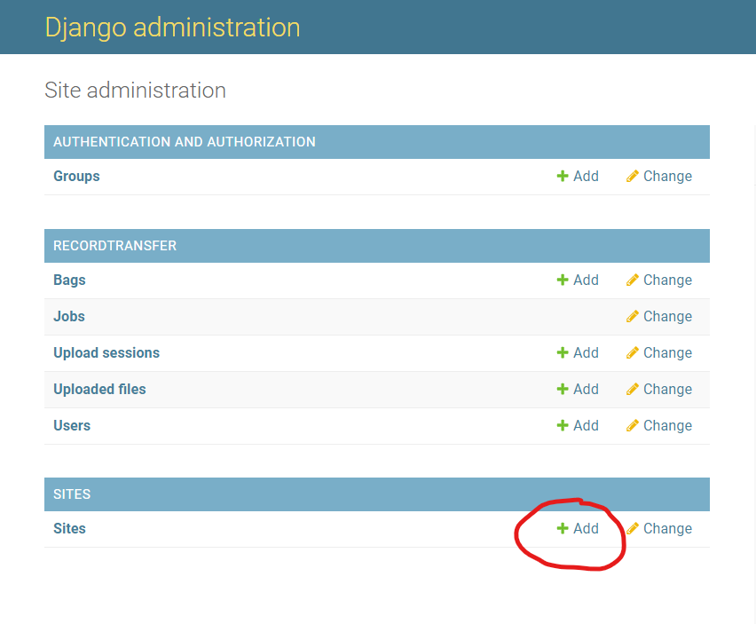
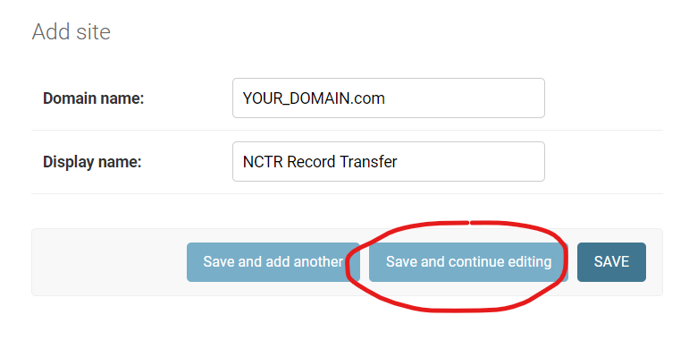
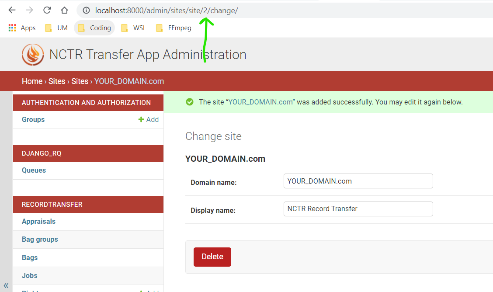

Deploying in Production
=======================

The setup for a production build is much more involved than the development and Docker methods.

To manage services, systemd is used. The OS used for this guide is Red Hat Enterprise Linux 7 (RHEL
7). There may be some differences if you intend to deploy the app on a different Linux distribution,
but the basics should be the same.

At the end of the process, the most important files will be placed at the following locations in the
file system:

::

    /
    |_ etc/
        |_ nginx/
            |_ sites-available/
                |_ recordtransfer.conf
            |_ sites-enabled/
                |_ recordtransfer.conf -> /etc/nginx/sites-available/recordtransfer.conf
        |_ systemd/
            |_ system/
                |_ gunicorn.service         (User-defined service)
                |_ rqworker_default.service (User-defined service)
    |_ opt/
        |_ NCTR-Bagit-Record-Transfer/
            |_ bagitobjecttransfer/ (Django App)
            |_ .env                 (App Environment Variables)
    |_ run/
        |_ clamd.scan/
            |_ clamd.sock
        |_ gunicorn/
            |_ gunicorn.sock
    |_ srv/
        |_ www/
            |_ recordtransfer_bags/ (Where BagIt bags are stored)
    |_ usr/
        |_ lib/
            |_ systemd/
                |_ system/
                    |_ mysqld.service
                    |_ nginx.service
                    |_ redis.service
                    |_ postfix.service

1. Clone Record Transfer App
############################

.. note::

    We are using Python version **3.6.8**. You can
    `download Python 3.6.8 here <https://www.python.org/downloads/release/python-368/>`_.

If you have not already done so, clone the application. Once it's cloned, move the repo into the
:code:`/opt/` directory. We will be using the :code:`/opt/` folder to serve the application from.

.. code-block:: console

    $ cd ~
    $ git clone https://github.com/danloveg/NCTR-Bagit-Record-Transfer.git
    $ sudo mv NCTR-Bagit-Record-Transfer /opt/

Create a virtual environment to install dependencies and to run the app from.

.. code-block:: console

    $ cd /opt/NCTR-Bagit-Record-Transfer
    $ python3 -m venv env/

Install Django and all other dependencies in the virtual environment.

.. code-block:: console

    $ source env/bin/activate
    (env) $ cd bagitobjecttransfer
    (env) $ pip install -r requirements.txt

Create an environment variable file for the application at
:code:`/opt/NCTR-Bagit-Record-Transfer/.env`:

.. code-block:: console

    (env) $ touch /opt/NCTR-Bagit-Record-Transfer/.env

We will be editing this file throughout this guide. For right now, we only need specify that we want
to use the production settings:

::

    # file /opt/NCTR-Bagit-Record-Transfer/.env
    DJANGO_SETTINGS_MODULE=bagitobjecttransfer.settings.production

2. NGINX Setup
##############

.. note::

    We are using NGINX version **1.18.0**. You can
    `download NGINX 1.18.0 here <https://nginx.org/en/download/nginx-1.18.0.tar.gz>`_.

`NGINX <https://www.nginx.com/resources/wiki/>`_ is a high performance HTTP server and reverse
proxy. NGINX is used as both an HTTP server and a reverse proxy for the record transfer application.
It is used as an HTTP server for serving static content, and acts as a reverse proxy when requests
are sent to Gunicorn to interpret.

To serve the files from the application folder, NGINX needs the proper permissions to access the
files in the folder. Recursively set the owner and the group of every folder and file in the
application folder to **nginx**:

.. code-block:: console

    (env) $ sudo chown -R nginx:nginx /opt/NCTR-Bagit-Record-Transfer/

Make sure the system initialization script at
:code:`/usr/lib/systemd/system/nginx.service` exists and looks something like this:

.. code-block:: ini

    # file /usr/lib/systemd/system/nginx.service
    [Unit]
    Description=nginx - high performance web server
    Documentation=http://nginx.org/en/docs/
    After=network-online.target remote-fs.target nss-lookup.target
    Wants=network-online.target

    [Service]
    Type=forking
    PIDFile=/var/run/nginx.pid
    ExecStart=/usr/sbin/nginx -c /etc/nginx/nginx.conf
    ExecReload=/bin/sh -c "/bin/kill -s HUP $(/bin/cat /var/run/nginx.pid)"
    ExecStop=/bin/sh -c "/bin/kill -s TERM $(/bin/cat /var/run/nginx.pid)"
    ExecStartPost = /bin/sleep 0.1

    [Install]
    WantedBy=multi-user.target

If you want to make changes, make a copy to :code:`/etc/systemd/system/nginx.service` and edit the
file there. This will override the file in :code:`/usr/lib/systemd/system/`:

.. code-block:: console

    (env) $ sudo cp /usr/lib/systemd/system/nginx.service /etc/systemd/system/nginx.service
    (env) $ sudo chmod 644 /etc/systemd/system/nginx.service

.. note::

    See the
    `RHEL 7 documentation section 10.6.4 <https://access.redhat.com/documentation/en-us/red_hat_enterprise_linux/7/html/system_administrators_guide/chap-Managing_Services_with_systemd#brid-Managing_Services_with_systemd-Overriding_Unit_Mod>`_
    for more information on overriding the systemd service file.

If you've made changes to the systemd script, reload the daemon to capture the new changes:

.. code-block:: console

    (env) $ sudo systemctl daemon-reload

Once you're satisfied with the systemd script, enable the nginx service to start on system startup:

.. code-block:: console

    (env) $ sudo systemctl enable nginx

NGINX requires a configuration file to determine how to serve the record transfer application, so
create a new file at :code:`/etc/nginx/sites-available/recordtransfer.conf` and add these contents
to it, substituting :code:`your_domain_or_ip` with your actual domain or IP:

.. code-block:: nginx

    # file /etc/nginx/sites-available/recordtransfer.conf
    server {
        listen 80;
        server_name your_domain_or_ip;

        location = /favicon.ico { access_log off; log_not_found off; }

        location /static/ {
            root /opt/NCTR-Bagit-Record-Transfer/bagitobjecttransfer;
        }

        location /transfer/uploadfile/ {
            # Maximum size of file that can be uploaded
            client_max_body_size 1024M;
        }

        location / {
            proxy_set_header Host $http_host;
            proxy_set_header X-Real-IP $remote_addr;
            proxy_set_header X-Forwarded-For $proxy_add_x_forwarded_for;
            proxy_set_header X-Forwarded-Proto $scheme;
            proxy_pass http://unix:/run/gunicorn/gunicorn.sock;
        }
    }

This configuration assumes you have a unix socket file set up for gunicorn at
:code:`/run/gunicorn/gunicorn.sock`, which is not set up *yet* but we will address this issue soon.

Enable the site by linking the configuration in the sites-enabled directory:

.. code-block:: console

    (env) $ sudo ln -s /etc/nginx/sites-available/recordtransfer.conf /etc/nginx/sites-enabled/recordtransfer.conf

3. Gunicorn Setup
#################

.. note::

    If the application dependencies have been installed with :code:`pip` as specified above in
    section 1, gunicorn **20.0.4** will already be installed inside the application's virtual
    environment! Hooray for pure python dependencies!

`Gunicorn <https://gunicorn.org/>`_ is a WSGI server that sits between NGINX and the Django
application. NGINX forwards non-trivial requests to Gunicorn, where it interprets the HTTP requests
and forwards them to Django in a way it understands.

A systemd initialization script is not created when gunicorn is installed, so go ahead and create a
new script for gunicorn at :code:`/etc/systemd/system/gunicorn.service`:

.. code-block:: console

    (env) $ sudo touch /etc/systemd/system/gunicorn.service
    (env) $ sudo chmod 644 /etc/systemd/system/gunicorn.service

Open the service files you created, and add these contents to the file:

.. code-block:: ini
    :emphasize-lines: 12

    # file /etc/systemd/system/gunicorn.service
    [Unit]
    Description=Gunicorn WSGI Daemon
    After=network.target

    [Service]
    User=nginx
    Group=nginx
    WorkingDirectory=/opt/NCTR-Bagit-Record-Transfer/bagitobjecttransfer
    ExecStart=/opt/NCTR-Bagit-Record-Transfer/env/bin/gunicorn \
        --workers 3 \
        --bind unix:/run/gunicorn/gunicorn.sock \
        --capture-output \
        --enable-stdio-inheritance \
        bagitobjecttransfer.wsgi

    [Install]
    WantedBy=multi-user.target

.. note::

    The RHEL 7 documentation recommends custom systemd initialization scripts to be placed at
    :code:`/etc/systemd/system/` rather than :code`/usr/lib/systemd/system/`. See the
    `RHEL 7 documentation section 10.6.2 <https://access.redhat.com/documentation/en-us/red_hat_enterprise_linux/7/html/system_administrators_guide/chap-managing_services_with_systemd>`_
    for more information on creating custom systemd services.

Enable the gunicorn service to start on system startup:

.. code-block:: console

    (env) $ sudo systemctl daemon-reload
    (env) $ sudo systemctl enable gunicorn

Create the directory in the :code:`run` directory for the gunicorn UNIX socket to be placed
(otherwise gunicorn may not have permission to create the directory):

.. code-block:: console

    (env) $ sudo mkdir /run/gunicorn/
    (env) $ sudo chown nginx:nginx /run/gunicorn/

4. Redis Setup
##############

.. note::

    We are using Redis version **3.2.12**. You can
    `download Redis 3.2.12 here <http://download.redis.io/releases/redis-3.2.12.tar.gz>`_.

Make sure the system initialization script at
:code:`/usr/lib/systemd/system/redis.service` exists and looks something like this:

.. code-block:: ini

    # file /usr/lib/systemd/system/redis.service
    [Unit]
    Description=Redis persistent key-value database
    After=network.target
    After=network-online.target
    Wants=network-online.target

    [Service]
    ExecStart=/usr/bin/redis-server /etc/redis.conf --supervised systemd
    ExecStop=/usr/libexec/redis-shutdown
    Type=notify
    User=redis
    Group=redis
    RuntimeDirectory=redis
    RuntimeDirectoryMode=0755

    [Install]
    WantedBy=multi-user.target

If you want to make changes, make a copy to :code:`/etc/systemd/system/redis.service` and edit the
file there. This will override the file in :code:`/usr/lib/systemd/system/`:

.. code-block:: console

    (env) $ sudo cp /usr/lib/systemd/system/redis.service /etc/systemd/system/redis.service
    (env) $ sudo chmod 644 /etc/systemd/system/redis.service

If you've made changes to the systemd script, reload the daemon to capture the new changes:

.. code-block:: console

    (env) $ sudo systemctl daemon-reload

Once you're satisfied with the systemd script, enable the redis service to start on system startup:

.. code-block:: console

    (env) $ sudo systemctl enable redis

You may notice that the service script tells redis that the configuration file is at
:code:`/etc/redis.conf`. If you do not have a redis configuration file already, you can get a
`redis conf here <https://raw.githubusercontent.com/redis/redis/3.0/redis.conf>`_ and copy it to
:code:`/etc/redis.conf`. You will want to edit a few of the default settings; to do so, search in
the :code:`/etc/redis.conf` file and change these settings:

::

    # file /etc/redis.conf
    databases 1
    logfile /var/log/redis/redis.log
    dir /var/lib/redis/
    supervised systemd

5. RQ Worker Setup
##################

.. note::

    If the application dependencies have been installed with :code:`pip` as specified above in
    section 1, Django-RQ **2.3.2** will already be installed inside the application's virtual
    environment! Hooray for pure python dependencies!

The RQ worker is an aysnchronous worker that interacts with the Django application and the Redis
server to run tasks off the main thread of the Django app. The implementation used is
`Django-RQ <https://github.com/rq/django-rq>`_, based on the `RQ <https://github.com/rq/rq>`_
library.

A systemd initialization script is not created when Django-RQ is installed, so go ahead and create a
new script for Django-RQ at :code:`/etc/systemd/system/rqworker_default.service`:

.. code-block:: console

    (env) $ sudo touch /etc/systemd/system/rqworker_default.service
    (env) $ sudo chmod 644 /etc/systemd/system/rqworker_default.service

Open the service file you created, and add these contents to the file:

.. code-block:: ini

    # file /etc/systemd/system/rqworker_default.service
    [Unit]
    Description=Django-RQ Worker (default priority)
    After=network.target redis.service

    [Service]
    WorkingDirectory=/opt/NCTR-Bagit-Record-Transfer/
    ExecStart=/opt/NCTR-Bagit-Record-Transfer/env/bin/python \
        bagitobjecttransfer/manage.py rqworker default

Enable the rqworker_default service to start on system startup:

.. code-block:: console

    (env) $ sudo systemctl daemon-reload
    (env) $ sudo systemctl enable rqworker_default

We also need to tell the Django record transfer app how to access the RQ
workers. To do so, add the following lines to the 
:code:`/opt/NCTR-Bagit-Record-Transfer/.env` file:

::

    # file /opt/NCTR-Bagit-Record-Transfer/.env
    RQ_HOST_DEFAULT=localhost
    RQ_PORT_DEFAULT=6379
    RQ_DB_DEFAULT=0
    RQ_PASSWORD_DEFAULT=
    RQ_TIMEOUT_DEFAULT=500

6. MySQL Setup
##############

.. note::

    We are using MySQL Community Server version **8.0.22**. Download
    `MySQL Community Server here <https://dev.mysql.com/downloads/mysql/>`_.

    If the application dependencies have been installed with :code:`pip` as specified above in
    section 1, MySQL Connector/Python **8.0.22** will already be installed inside the application's
    virtual environment! Hooray for pure python dependencies!

`MySQL <https://www.mysql.com/>`_ is the chosen relational database system for the record transfer
application. MySQL is well supported, reliable, and stable. Django interacts with MySQL using the
`MySQL Connector/Python <https://github.com/mysql/mysql-connector-python>`_ library.

Make sure the system initialization script at
:code:`/usr/lib/systemd/system/mysqld.service` exists and looks something like this:

.. code-block:: ini

    # file /usr/lib/systemd/system/mysqld.service
    [Unit]
    Description=MySQL Server
    Documentation=man:mysqld(8)
    Documentation=http://dev.mysql.com/doc/refman/en/using-systemd.html
    After=network.target
    After=syslog.target

    [Install]
    WantedBy=multi-user.target

    [Service]
    User=mysql
    Group=mysql

    Type=notify

    # Disable service start and stop timeout logic of systemd for mysqld service.
    TimeoutSec=0

    # Execute pre and post scripts as root
    PermissionsStartOnly=true

    # Needed to create system tables
    ExecStartPre=/usr/bin/mysqld_pre_systemd

    # Start main service
    ExecStart=/usr/sbin/mysqld $MYSQLD_OPTS

    # Use this to switch malloc implementation
    EnvironmentFile=-/etc/sysconfig/mysql

    # Sets open_files_limit
    LimitNOFILE = 10000

    Restart=on-failure

    RestartPreventExitStatus=1

    # Set enviroment variable MYSQLD_PARENT_PID. This is required for restart.
    Environment=MYSQLD_PARENT_PID=1

    PrivateTmp=false

If you want to make changes, make a copy to :code:`/etc/systemd/system/mysqld.service` and edit the
file there. This will override the file in :code:`/usr/lib/systemd/system/`:

.. code-block:: console

    (env) $ sudo cp /usr/lib/systemd/system/mysqld.service /etc/systemd/system/mysqld.service
    (env) $ sudo chmod 644 /etc/systemd/system/mysqld.service

If you've made changes to the systemd script, reload the daemon to capture the new changes:

.. code-block:: console

    (env) $ sudo systemctl daemon-reload

Enable the mysqld service to start on system startup, and start the service (we will need to
interact with mysql in the upcoming steps):

.. code-block:: console

    (env) $ sudo systemctl enable mysqld
    (env) $ sudo systemctl start mysqld

You can check whether the service has started with:

.. code-block:: console

    (env) $ sudo systemctl status mysqld

Once the MySQL server has started up, we will need to log in to MySQL and do two things:

1. Create an empty database
2. Create a user for the database

*************************
6.1 Create Empty Database
*************************

To create an empty database, log in to the running MySQL server:

.. code-block:: console

    (env) $ sudo mysql -u root

When you're logged in, check to make sure the database has not already been created. Execute a
SHOW query to see all the databases. You'll see something like the below output if the database
hasn't been created already. If you see a database named :code:`recordtransfer`, the database
already exists.

::

    mysql> SHOW DATABASES;
    +--------------------+
    | Database           |
    +--------------------+
    | information_schema |
    | mysql              |
    | performance_schema |
    | sys                |
    +--------------------+
    4 rows in set (0.00 sec)

Create the **recordtransfer** database if it hasn't been created already:

::

    mysql> CREATE DATABASE recordtransfer;
    Query OK, 1 row affected (0.00 sec)

************************
6.2 Create Database User
************************

Now that the database exists, we will create a new account for this database that the record
transfer app will use to interact with the database. We will call the user **django**. Remember the
password you use, you will need to enter it one more place later.

::

    mysql> CREATE USER 'django'@'%' IDENTIFIED WITH mysql_native_password BY 'password';
    Query OK, 0 rows affected (0.00 sec)

    mysql> GRANT ALL ON recordtransfer.* TO 'django'@'%';
    Query OK, 0 rows affected (0.00 sec)

    mysql> FLUSH PRIVILEGES;
    Query OK, 0 rows affected (0.00 sec)

    mysql> EXIT;
    Bye

.. note::

    If you get an error when creating the password that it doesn't meet the policy requirements, you
    can check the requirements by running the MySQL query:

    ::

        SHOW VARIABLES LIKE 'validate_password%';

    You can find more info on `MySQL password validation here
    <https://dev.mysql.com/doc/refman/8.0/en/validate-password-options-variables.html>`_.

***************************************
6.3 Add MySQL Connection to Environment
***************************************

To tell the record transfer app to use the **recordtransfer** MySQL database as the **django** user,
add these lines to the environment file at :code:`/opt/NCTR-Bagit-Record-Transfer/.env`, remembering
to replace **your_password** with the actual password you created above:

::

    # file /opt/NCTR-Bagit-Record-Transfer/.env
    MYSQL_HOST=localhost
    MYSQL_DATABASE=recordtransfer
    MYSQL_USER=django
    MYSQL_PASSWORD=your_password

************************************
6.4 Migrate Record Transfer Database
************************************

.. warning::

    For the following steps, make sure that your virtual environment is activated before calling
    :code:`python3`! You can tell it's active if your command prompt starts with **(env)**. To
    activate the virtual environment, source the activation script:

    .. code-block:: console

        $ source /opt/NCTR-Bagit-Record-Transfer/env/bin/activate
        (env) $

After MySQL is set up, you can populate the new **recordtransfer** database with the tables for the
record transfer application. This process is called *database migration*. To apply the migrations,
change to the directory of the record transfer application that has the :code:`manage.py` script,
and run the migration:

.. code-block:: console

    (env) $ python3 manage.py migrate

***********************
6.5 Create a Super User
***********************

Now that the database is ready to be used by the application, we should create a super user that has
full access to the application and the database. This user is necessary to create other staff users
and administrators. Without this user, no one will be able to access the administrator website. You
can think of this super user as analogous to the application as the **django** user we created above
is to the MySQL database.

Make sure you are in the same directory as the :code:`manage.py` script. Run the super user creation
command and follow the prompts, remembering the username and password you enter.

.. code-block:: console

    (env) $ python3 manage.py createsuperuser

Once this user is created, you will be able to log in to the record transfer application to transfer
records as well as administer transfers and other users.

7. Email Setup
##############

.. note::

    We are using Postfix **2.10.1** to relay emails. On CentOS / RedHat, install postfix with

    .. code-block:: console

        $ yum install postfix

Postfix is used as a relay mail server that is used for sending emails to users and archivists. You
will want to have a dedicated SMTP server somewhere else that postfix can relay emails to. Find
`more information on setting up postfix here <https://www.linode.com/docs/guides/postfix-smtp-debian7/>`_.

Make sure the system initialization script at
:code:`/usr/lib/systemd/system/postfix.service` exists and looks something like this:

.. code-block:: ini

    [Unit]
    Description=Postfix Mail Transport Agent
    After=syslog.target network.target
    Conflicts=sendmail.service exim.service

    [Service]
    Type=forking
    PIDFile=/var/spool/postfix/pid/master.pid
    EnvironmentFile=-/etc/sysconfig/network
    ExecStartPre=-/usr/libexec/postfix/aliasesdb
    ExecStartPre=-/usr/libexec/postfix/chroot-update
    ExecStart=/usr/sbin/postfix start
    ExecReload=/usr/sbin/postfix reload
    ExecStop=/usr/sbin/postfix stop

    [Install]
    WantedBy=multi-user.target

If you want to make changes, make a copy to :code:`/etc/systemd/system/postfix.service` and edit the
file there. This will override the file in :code:`/usr/lib/systemd/system/`:

.. code-block:: console

    (env) $ sudo cp /usr/lib/systemd/system/postfix.service /etc/systemd/system/postfix.service
    (env) $ sudo chmod 644 /etc/systemd/system/postfix.service

If you've made changes to the systemd script, reload the daemon to capture the new changes:

.. code-block:: console

    (env) $ sudo systemctl daemon-reload

Open the postfix configuration file at :code:`/etc/postfix/main.cf` and make sure to set
:code:`myhostname` to your domain name, and :code:`relayhost` to your SMTP server:

::

    # file /etc/postfix/main.cf

    myhostname = YOUR_DOMAIN_HERE
    relayhost = YOUR_SMTP_HOST_HERE

Once you're satisfied with the systemd script and the configuration file, enable the postfix service
to start on system startup:

.. code-block:: console

    (env) $ sudo systemctl enable postfix

You will need to let the Django record transfer app know where to send emails. Edit the
:code:`/opt/NCTR-Bagit-Record-Transfer/.env` file and add the following lines, substituting
mail_user for your mailing username (if you require one) and mail_password for your mailing password
(if you require one). Also, set an ARCHIVIST_EMAIL to an administrator email address that you'll use
to accept questions and inquiries:

::

    # file /opt/NCTR-Bagit-Record-Transfer/.env
    ARCHIVIST_EMAIL=you@example.com
    EMAIL_HOST=localhost
    EMAIL_PORT=25
    EMAIL_HOST_USER=mail_user
    EMAIL_HOST_PASSWORD=mail_password
    EMAIL_USE_TLS=True

Note that you can only set one of EMAIL_USE_SSL or EMAIL_USE_TLS to True. Both are False by default
so you have to manually turn one on.

8. Final Checklist
##################
 
After getting to this stage, you are almost ready to start the application up. Read through the
following sections carefully, as they are important.

****************
8.1 Static Files
****************

To serve static files (JavaScript, CSS, images, etc.) from NGINX, you will need to
`collect the static files <https://docs.djangoproject.com/en/3.1/ref/contrib/staticfiles/#collectstatic>`_.
This simply means copying the static files to the /static/ directory. Without doing this, NGINX will
not know where to find the static files. If you get a prompt asking if you want to overwrite files,
type :code:`yes` and press ENTER. For good measure, re-set the user & group of all files to
**nginx:nginx**:

.. code-block:: console

    (env) $ cd /opt/NCTR-Bagit-Record-Transfer/bagitobjecttransfer
    (env) $ python3 manage.py collectstatic
    (env) $ sudo chown -R nginx:nginx /opt/NCTR-Bagit-Record-Transfer/static/

*************************
8.2 Transfer Storage Area
*************************

The transfer storage area is where all of the BagIt bags are stored on the server. When a user sends
a transfer, the uploaded files and metadata are combined into a BagIt bag. You can choose any folder
to store these bags in, but we are using :code:`/srv/www/recordtransfer_bags`. Set the owner of the
folder to **nginx** so that the application will be able to access the files.

.. code-block:: console

    (env) $ sudo mkdir -p /srv/www/recordtransfer_bags
    (env) $ sudo chown nginx:nginx /srv/www/recordtransfer_bags

Tell the Django application where the transfers are stored by setting the BAG_STORAGE_FOLDER
environment variable:

::

    # file /opt/NCTR-Bagit-Record-Transfer/.env
    BAG_STORAGE_FOLDER=/srv/www/recordtransfer_bags/

*******************************
8.3 Final Environment Variables
*******************************

So far, your environment file (:code:`/opt/NCTR-Bagit-Record-Transfer/.env`) should look something
like this:

::

    # file /opt/NCTR-Bagit-Record-Transfer/.env
    DJANGO_SETTINGS_MODULE=bagitobjecttransfer.settings.production
    BAG_STORAGE_FOLDER=/srv/www/recordtransfer_bags/

    RQ_HOST_DEFAULT=localhost
    RQ_PORT_DEFAULT=6379
    RQ_DB_DEFAULT=0
    RQ_PASSWORD_DEFAULT=
    RQ_TIMEOUT_DEFAULT=500

    ARCHIVIST_EMAIL=you@example.com
    EMAIL_HOST=localhost
    EMAIL_PORT=25
    EMAIL_HOST_USER=mail_user
    EMAIL_HOST_PASSWORD=mail_password
    EMAIL_USE_TLS=True

    MYSQL_HOST=localhost
    MYSQL_DATABASE=recordtransfer
    MYSQL_USER=django
    MYSQL_PASSWORD='password'

There are two final variables to set. The first is the SECRET_KEY. To set this variable, you will
need to generate a new secret key. To do so, run the following command:

.. code-block:: console

    (env) $ python3 -c "from django.core.management import utils; print(utils.get_random_secret_key())"
    &kz_(%wj8$v@cy1)23op8i$_)h2b6kl)ia6glv_*c=1(assr#b

The SECRET_KEY output in the terminal can then be copy and pasted into the environment file, like
so:

::

    # file /opt/NCTR-Bagit-Record-Transfer/.env
    SECRET_KEY=&kz_(%wj8$v@cy1)23op8i$_)h2b6kl)ia6glv_*c=1(assr#b

The second variable you need to set is HOST_DOMAINS. Set this to the domain(s) of your website:

::

    # file /opt/NCTR-Bagit-Record-Transfer/.env
    HOST_DOMAINS=YOUR_DOMAIN_HERE

.. note::

    The domains you put in HOST_DOMAINS will be used as Django's
    `ALLOWED_HOSTS <https://docs.djangoproject.com/en/3.1/ref/settings/#allowed-hosts>`_. You can
    add more than one domain by separating domain names with spaces.

And that's it! All of the required environment variables should now be set.

9. Start Services
#################

With all of the setup out of the way, you can finally start all of the application services:

.. code-block:: console

    (env) $ sudo systemctl start mysqld
    (env) $ sudo systemctl start redis
    (env) $ sudo systemctl start rqworker_default
    (env) $ sudo systemctl start gunicorn
    (env) $ sudo systemctl start nginx

If you want to be sure NGINX loaded your configuration file, you can check the configuration it's
using with:

.. code-block:: console

    (env) $ sudo nginx -T

10. Admin Set-up
###################

Once you have the site running, you'll need to log in as the superuser you created, and set the name
of the site and the domain in the database. You can either do this with the command line or with the
Django admin.

*********************************************
10.1 Add Site Name and Domain in Django Admin
*********************************************

To do set the name and domain using the Django admin, log in to http://yourdomain.com/admin/,
substituting yourdomain.com for the domain the app is being hosted at. You will want to use the same
credentials to log in that you created in section :ref:`6.5 Create a Super User`.

Once logged in, click **+ Add** under the Sites section to add your site:

Fill out your domain name, and give the website a name (you can change the name later if you don't
like it). Once filled out, click the blue **Save and continue** button.

Once saved, take a look at the address in the address bar for your new site. You will see something
like YOUR_DOMAIN.com/admin/sites/site/**2**/change. The important part to note is the number. This
number is the SITE_ID. The Django site is set to use Site #2, so if you see the number **2** here,
you are good to go!

If the number you see is not **2**, you will have to edit the environment variables file and change
SITE_ID to the correct number. If the number you see is **3**, for example, you will make the
following change in the :code:`/opt/NCTR-Bagit-Record-Transfer/.env` file:

::

    # file /opt/NCTR-Bagit-Record-Transfer/.env
    SITE_ID=3

***********************************************
10.1 Add Site Name and Domain with Command Line
***********************************************

If you're more comfortable using the command line, you can also update the site name and domain
using a terminal. Change to the same directory as the :code:`manage.py`, make sure your virtual
environment is active, and open a shell in the application:

.. code:: console

    (env) $ python3 manage.py shell
    Python 3.6.8 (default, Aug 13 2020, 07:46:32)
    [GCC 4.8.5 20150623 (Red Hat 4.8.5-39)] on linux
    Type "help", "copyright", "credits" or "license" for more information.
    (InteractiveConsole)
    >>>

Your terminal will change to a Python shell with this command. You cannot use UNIX commands like
:code:`ls` or :code:`cd` in this shell. Use :code:`exit()` to close the shell, or **CTRL-Z**
followed by **ENTER**. Input the following Python "commands" into the shell:

.. code:: console

    >>> from django.contrib.sites.models import Site
    >>> site = Site(domain='YOUR_DOMAIN.com', name='NCTR Record Transfer')
    >>> site.save()
    >>> print(site.id)
    2
    >>> exit()

Note the ID shown after you input :code:`print(site.id)`. If the number you see is not **2**, you
will have to edit the environment variables file and change SITE_ID to the correct number. If the
number you see is **3**, for example, you will make the following change in the
:code:`/opt/NCTR-Bagit-Record-Transfer/.env` file:

::

    # file /opt/NCTR-Bagit-Record-Transfer/.env
    SITE_ID=3
