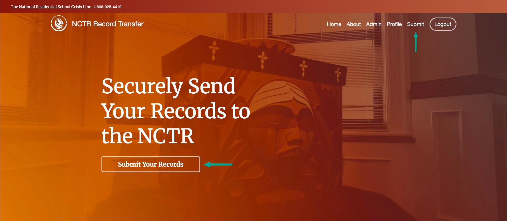
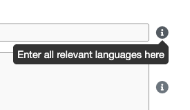
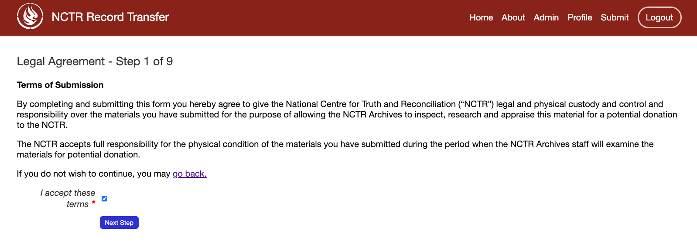
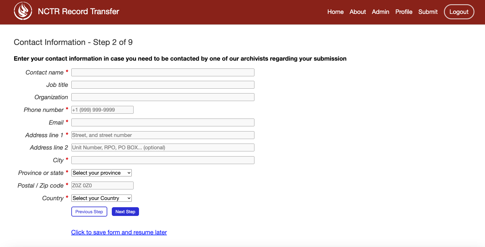
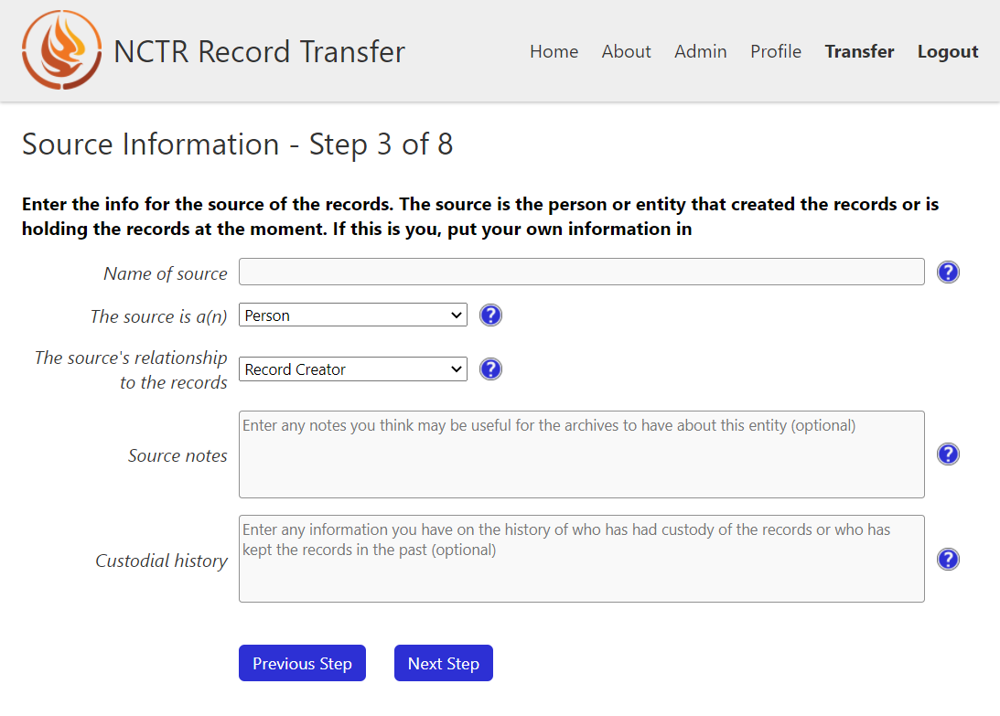
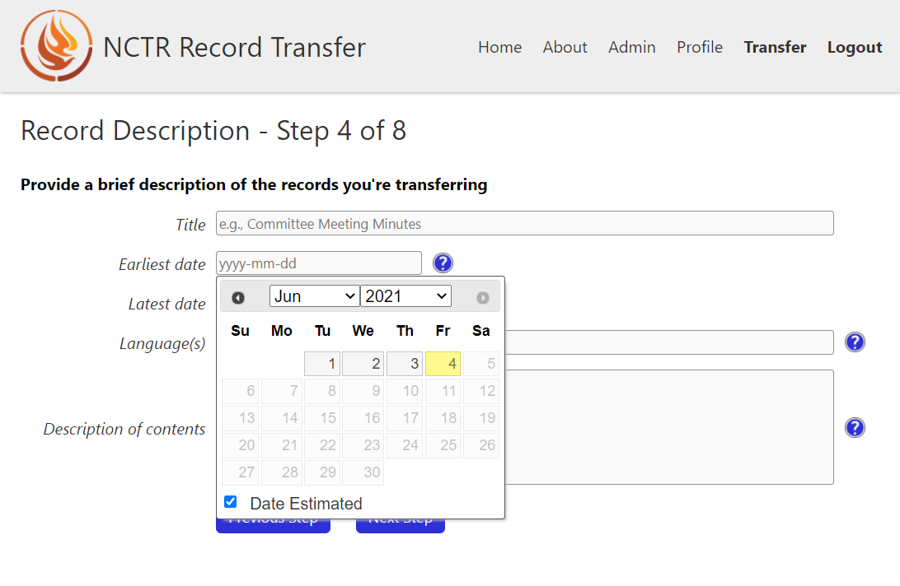
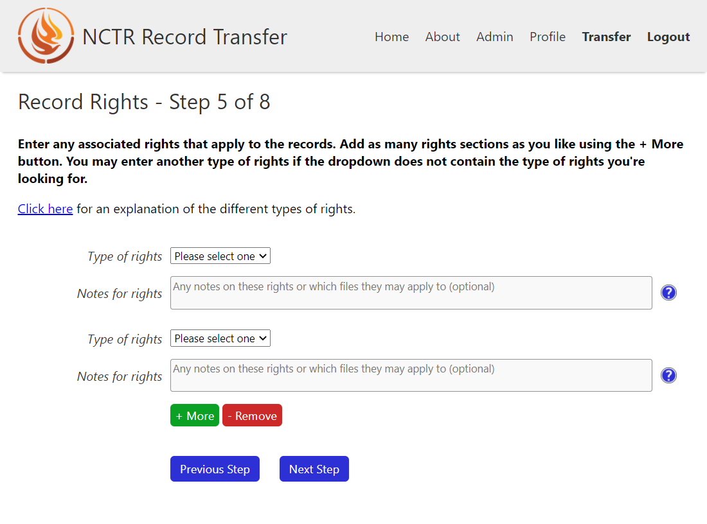
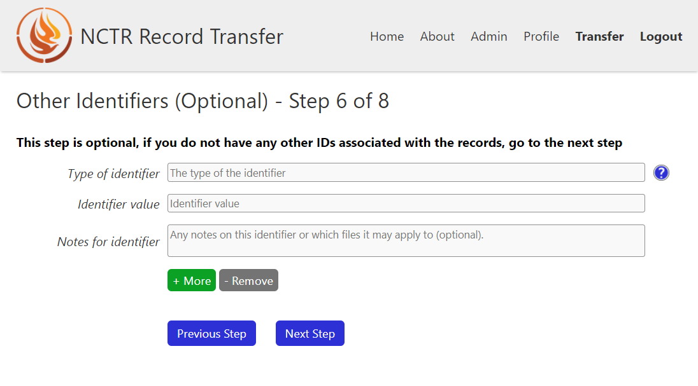
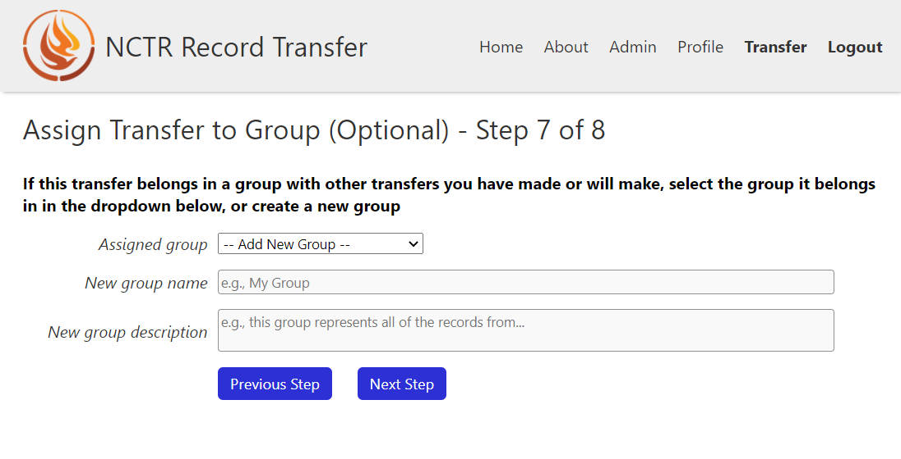
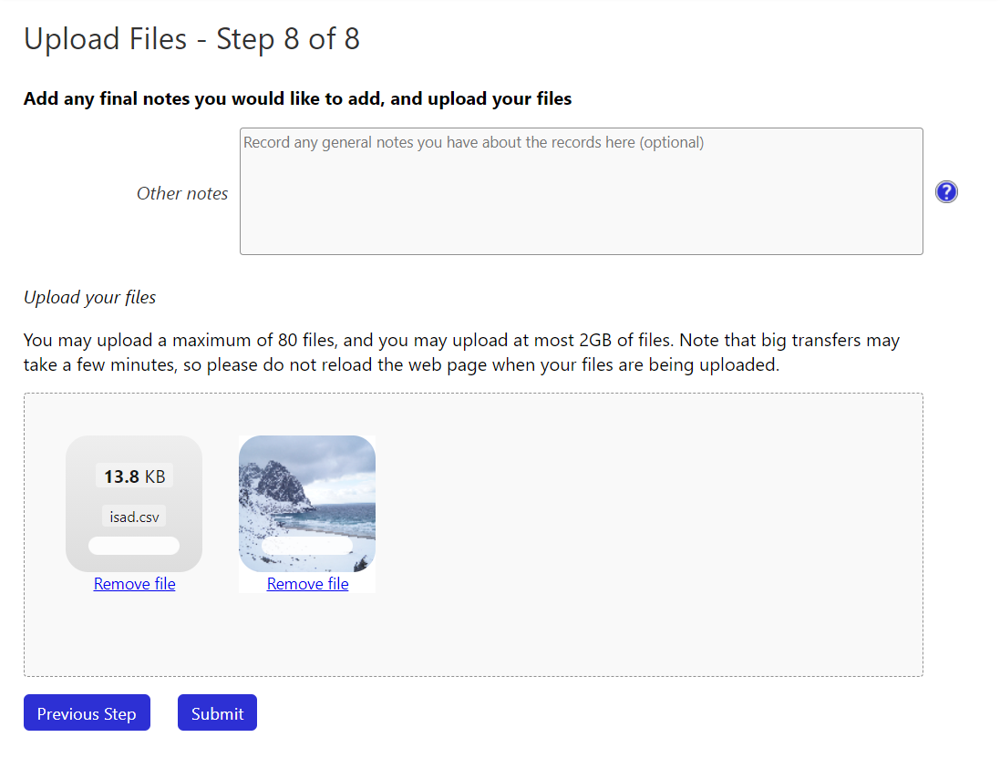

The Submission Form
===================

The Submission Form is the heart of the public-facing application, allowing you to provide
metadata about your records and upload files for transfer to your institution.

To start a submission, click on either "Submit" on the navigation bar or the "Submit Your Records"
on the homepage.

Form Navigation
##############

The submission form is divided into multiple steps to simplify the submission process.

Throughout the form, you'll notice grey question mark icons (i) next to many fields. Hover your
mouse over these icons to display helpful tooltips with additional guidance on how to complete each
field.

Step 1: Legal Agreement
#######################

In the first step of the form, the user must accept an agreement. This agreement will depend
entirely on what you are doing with the collected metadata and files. To proceed, someone must check
the agreement box before clicking **Next**.

Step 2: Contact information
###########################

This form is self explanatory. A person will enter their contact information here before clicking
**Next**.

Step 3: Source information
##########################

Here, the user will input information about the entity submitting the records. If the user is
submitting the transfer themselves, they will enter their own information. If they are submitting
the transfer on behalf of another person or an institution, they will put that institution's
information. CAAIS includes fields for adding notes about the source, as well as custodial history.
If someone feels inclined to include this information, they can click **Add Notes & History
(Optional)**.

In the above image, the **Add Notes & History (Optional)** button has been clicked to expose the
hidden fields.

Step 4: Record Description
##########################

In this step, users are asked for a very brief description of their transfer/records. They must
enter four pieces of information:

- A title
- The start and end date of the records. They can select "Estimated date" if the date is not exact
- The languages of the records
- A brief description of what the records contain

Step 5: Record Rights
#####################

Here, the user will enter the rights applying to their records. They must select at least one type
of rights that apply to their records. If the type is not present in the dropdown, they can select
Other and type in their own type of right. If they want to add multiple rights if, for example,
there are different rights for different records, they can click the **+ Add** button to add more.
Alternately, they can remove rights with the **- Remove** button.

If someone is confused about what the rights are for their records, they can open the rights
explanation dialog for a description for each type of right. You can find more information about the
rights in the section on :ref:`Adding Rights Taxonomies`.

Step 6: Other Identifiers
#########################

If the user has other identifiers that apply to their records, like an ISBN, or a barcode number,
they can put those here. They are not required to enter any here, so can skip to the next step if
needed.

Similar to the Rights form, users can add or remove sections of this form.

Step 7: Assign Transfer to Group
################################

If a user is splitting their transfer out into multiple steps, or if they just want to associate
their transfer with a group of other transfers they have or will make, they can do so here. They can
select previous groups from the dropdown, or add a new one with **-- Add New Group --**.

Step 8: Upload Files
####################

This is where the user can add files to their transfer. They must send at least one file for the
transfer to submit. They can add files to the file drop zone by clicking on it or by dragging and
dropping files into it. If they add a file that isn't accepted by your accepted file types, the
transfer will not be allowed to submit until they remove the offending files.

To see more about how to change what files are accepted, go to the section on
:ref:`ACCEPTED_FILE_FORMATS`.

.. note::

    For all other steps of the transfer form, the data entered is saved so users can bounce back and
    forward in the form without losing their data. Unfortunately, if a user adds files to the upload
    space, goes to a previous step in the form, and comes to the final step again, their files will
    no longer be there.

Post-Transfer
#############

If the final form submitted successfully, the user will immediately be re-routed to a thank you
page. The submission of the transfer form sets off a chain reaction of events. At a high level,
these things happen:

- A bagit Bag is created on the file system with the user's uploaded files and all of the form
  metadata. The location of this bag depends on what the APP_STORAGE_FOLDER is set to.
- A Bag object in the database is created. When the Bag is changed in the database, the bagit Bag
  on the filesystem is updated to match (provided it hasn't been moved).
- An email is sent to any staff user that has checked the "Gets bag email updates" box.
- An email is sent to the user who submitted the form.
